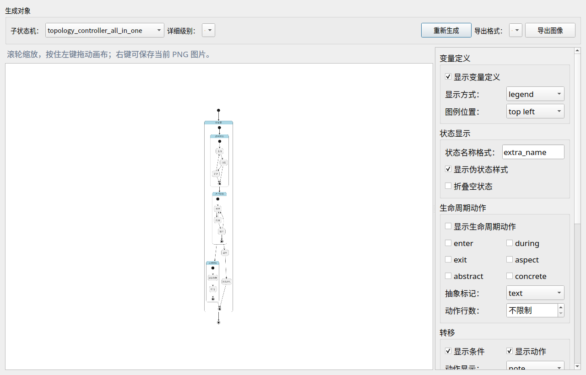
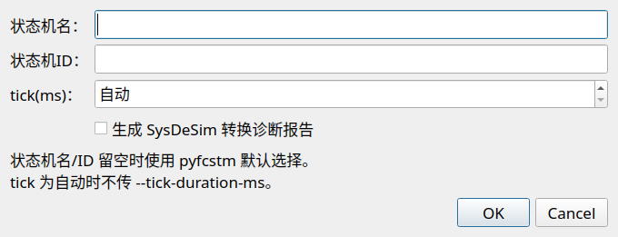
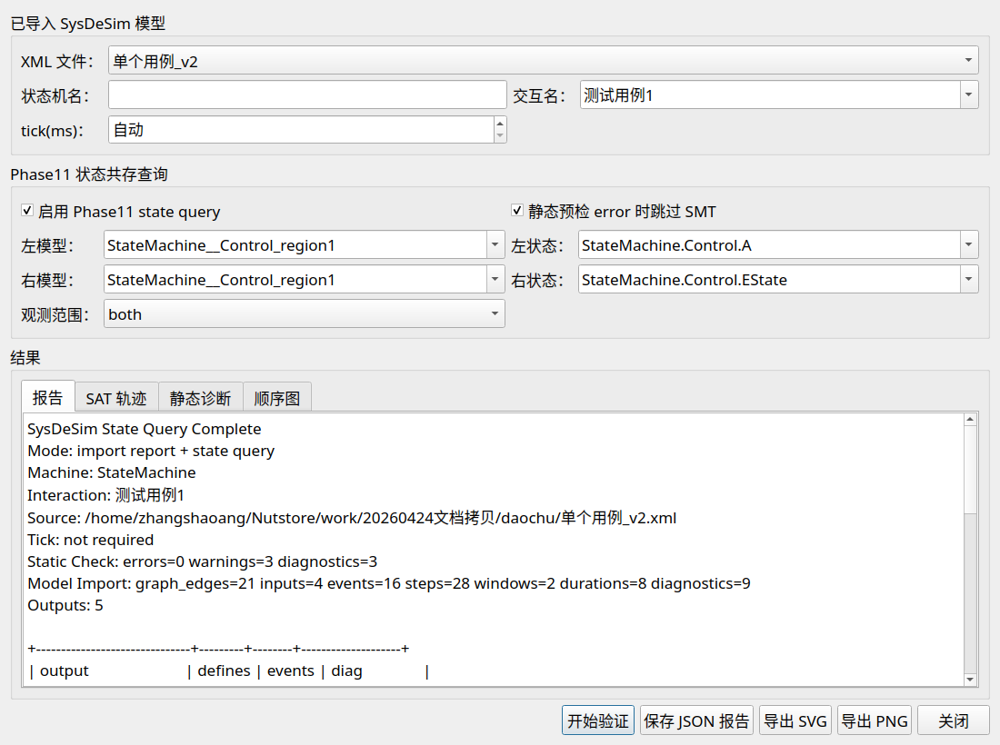
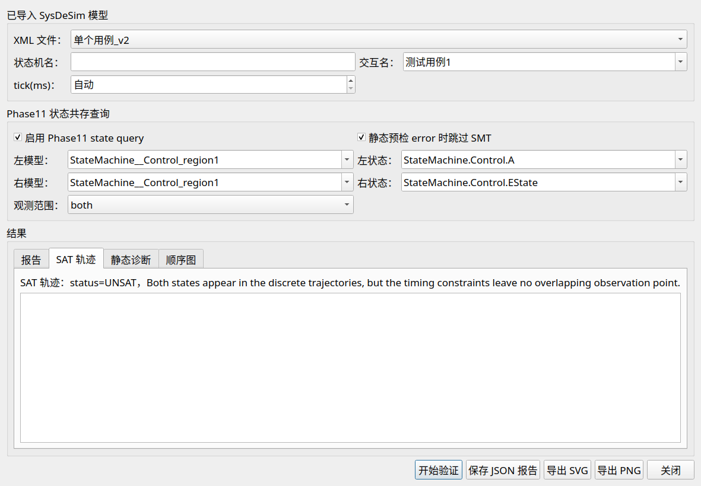
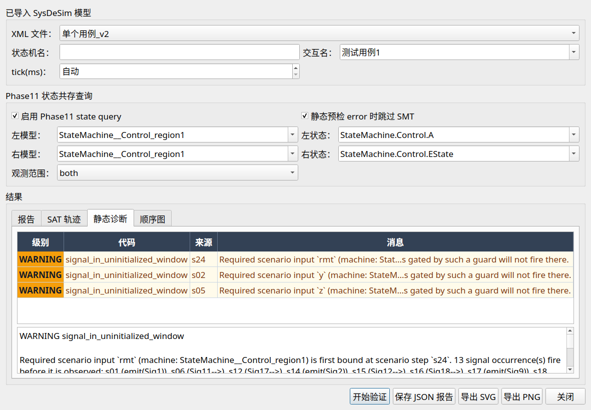
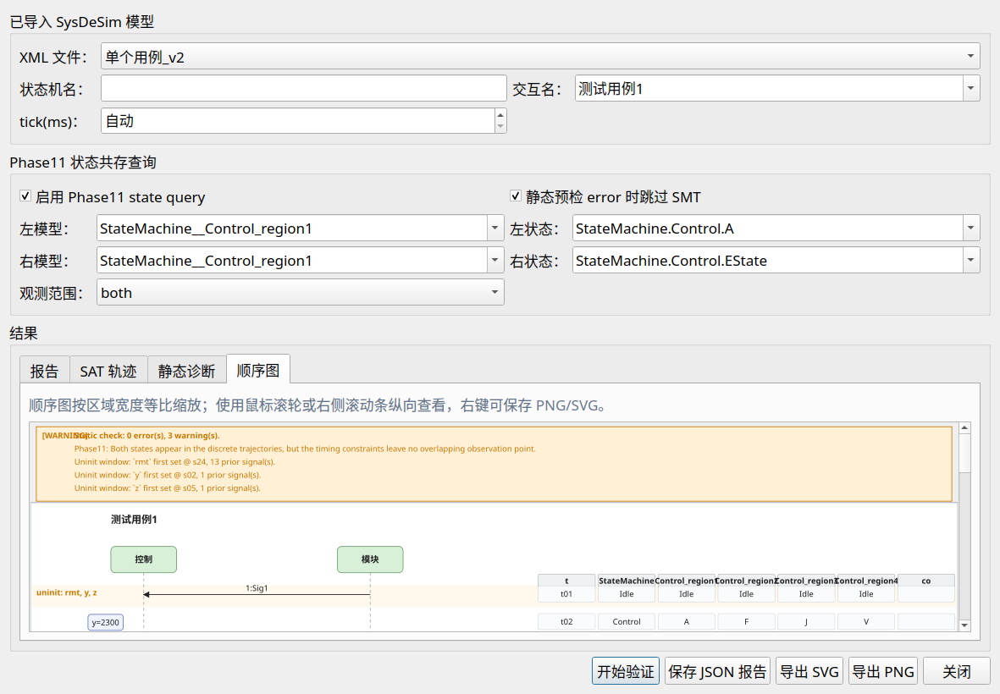

# `fcstm-ui` 专家现场验收测试规程

| 项 | 内容 |
|---|---|
| 文档版本 | v1.0 |
| 适用程序 | `fcstm-ui`（PyQt5 桌面端） + `pyfcstm`（命令行后端） |
| 适用平台 | Windows 10/11、Ubuntu 22.04+、macOS 13+（均为 x86_64） |
| 编制目的 | 供独立专家在交付现场按本文档逐项执行测试，对 fcstm-ui 的核心验证能力出具客观结论 |
| 文档结构 | §1 测试内容 ／ §2 具体步骤 ／ §3 充分性要求 ／ §4 通过准则；末尾附输入文件清单与命令行复现 |
| 阅读对象 | 仅需了解状态机与界面操作即可，无需阅读源代码 |

> 本规程依据 `fcstm-ui` 主分支代码、`pyfcstm` 库实际验证能力、以及随包提供的示例模型编写。
> 所有截图均在仓库 `docs/show_assets/gui/` 与 `docs/show_assets/cli/` 中可直接核对；本文档中相对路径均以本文件所在位置 `docs/` 为基准。
> 文档中若出现需要现场确认的细节，会显式标记“【待确认】”。

---

## 0. 测试环境与前置条件

### 0.1 软硬件要求

| 项 | 要求 |
|---|---|
| 操作系统 | Windows 10/11 x86_64、Ubuntu 22.04 LTS 及以上、macOS 13 及以上 |
| Java 运行时 | 系统 `PATH` 中存在 `java`（任意 JRE / OpenJDK 11+），用于 PlantUML 状态图渲染 |
| 屏幕分辨率 | 不低于 1280×800，建议 1600×900，以保证对话框完整可见 |
| 磁盘空间 | 至少 200 MB 用于解压程序、生成 `.fcstm` 中间文件与导出结果 |

### 0.2 随包文件

测试现场需准备以下文件（与本程序同目录或随测试包提供）：

| 文件名 | 来源 | 用途 |
|---|---|---|
| `fcstm-ui`（Linux/macOS） / `fcstm-ui.exe`（Windows） | 交付包（GitHub Release 或委托方分发） | 主程序，本规程的被测对象 |
| `topology_controller_all_in_one.fcstm` | 仓库 `docs/topology_controller_all_in_one.fcstm`（同时附 §A 全文，可现场粘贴生成） | §2 中 T-02 / T-03 / T-04 的标准输入 |
| `单个用例_v2.xml` | **不在源码仓库中**，由委托方在测试包内单独提供；现场可放置在任意可读目录 | §2 中 T-05、T-06a、T-06b 场景的标准输入 |
| `单个用例_v2_z1200_experiment.xml` | **不在源码仓库中**，由委托方在测试包内单独提供 | §2 中 T-06c 静态预检拦截阴性场景的输入 |

> 测试现场若任一 SysDeSim XML 文件缺失，T-05 / T-06 即无法启动；应在测试开始前向委托方索要并落盘到本地可读目录后再继续。

### 0.3 系统自检（强烈建议执行）

主程序内置 `--smoke-test` 自检命令，可在不打开图形界面的前提下验证全部底层依赖是否就位（Java、PlantUML、z3、字体等）。

操作：在终端执行

```bash
fcstm-ui --smoke-test 2>&1 | tail -45
```

> Windows 下若 `fcstm-ui.exe` 未加入 `PATH`，请改用解压后可执行所在的绝对路径，例如：
> `"C:\fcstm-ui\fcstm-ui.exe" --smoke-test`
> Linux / macOS 下若没有把可执行链接到 `PATH`，请改用 `./fcstm-ui --smoke-test`，从解压目录运行。

期望：终端最后一行输出 **`fcstm-ui smoke test: PASSED`**。


> 自检失败时输出会指明缺失的依赖（Java、字体、模板等），按提示补足即可。
> 该步骤通过后即可视为测试环境合格，所有后续测试均可开展。

---

## 1. 测试内容

`fcstm-ui` 的核心被测能力来自 `pyfcstm` 模型验证工具链与 `app/widget` 下的对话框，共计 **6 项一级测试内容**，每项细分阳性（应当成立）/阴性（应当不成立）子用例。

| 编号 | 测试内容 | 测试目的 | 涉及模块 | 输入数据 | 输出结果 |
|---|---|---|---|---|---|
| T-01 | 模型导入与状态图可视化 | 验证 `.fcstm` DSL 解析、模型加载、PlantUML 渲染、Java 通路 | `app/utils/dsl_to_ui.py`、`app/utils/show_state_graph.py`、`DialogShowGraph` | `topology_controller_all_in_one.fcstm` | 主窗口模型列表新增条目；状态图对话框中显示完整层次状态图（含中文标签） |
| T-02 | 拓扑可达性（reachability） | 验证“从源状态出发是否结构上能抵达目标状态” | `DialogTopologyVerify` + `pyfcstm topology reach` | 同上 + 源/目标状态对 | 报告标签页绿色横幅“可达”或红色横幅“不可达”，并附见证路径或不可达叶子表 |
| T-03 | 拓扑有穷性（finiteness） | 验证“是否存在结构上无限运行的陷阱环（trap-cycle）” | 同上 + `pyfcstm topology finite` | 同上 + 源状态（可选） | 报告标签页绿色“有穷”或红色“存在无限运行反例”，反例 trap-cycle 在拓扑图中染红 |
| T-04 | 拓扑必达性（inevitability） | 验证“目标状态是否在所有从源到终止的路径上必经” | 同上 + `pyfcstm topology inevitable` | 同上 + 源/目标状态对 | 报告标签页绿色“必达”或红色“可规避”，反例路径在 `路径/节点` 标签页与拓扑图标签页展示 |
| T-05 | SysDeSim 模型转换（XML → .fcstm） | 验证从 SysDeSim 顺序图自动拆分出主状态机与多个并行 region 的能力 | `app/utils/xml_converter.py`、`pyfcstm.convert.sysdesim`、`SysDeSim 转换选项` 对话框 | `单个用例_v2.xml` | 输出目录中生成 1 个主状态机 + 4 个 `region` 子模型 `.fcstm` 文件；左栏出现以 XML 文件名命名的分组节点及其下挂的 5 个子模型 |
| T-06 | SysDeSim 状态共存 / 互斥（Phase11） | 验证两个并行 region 中的状态是否能在 SysDeSim 顺序图所规定的时间线上同时成立；以及静态预检对前置错误的拦截 | `DialogSysdesimValidate` + `pyfcstm sysdesim validate` | `单个用例_v2.xml` 与 `单个用例_v2_z1200_experiment.xml` | `报告`／`SAT 轨迹`／`静态诊断`／`顺序图` 四个标签页齐全；按场景给出 `status=SAT`（共存）、`status=UNSAT`（结构互斥）或“SMT 跳过”（静态拦截）三种判定 |

每项测试均设阳性（标记 ✅）与阴性（标记 ❌）子用例，共 **11 个可执行子用例**，下一节逐项展开。

---

## 2. 具体步骤

> 阅读约定：每个测试项分为 **测试目的 / 前置条件 / 输入数据 / 工具入口 / 操作步骤 / 结果查看 / 结果说明** 七段。其中“操作步骤”全部使用界面上能直接看到的菜单、按钮、下拉文字。

### T-01 模型导入与状态图可视化

#### 测试目的

确认 `fcstm-ui` 能正确解析自有 DSL `.fcstm` 文件、加载为内存模型、并通过 PlantUML 渲染为可视化状态图。该项是后续所有拓扑验证测试的前置依赖。

#### 前置条件

- 已完成 §0.3 自检并 `PASSED`。
- `topology_controller_all_in_one.fcstm` 已置于本地任一可读目录。

#### 输入数据

`docs/topology_controller_all_in_one.fcstm`（DSL 全文见 §A）。

#### 工具入口

主程序 `fcstm-ui` 主窗口的菜单栏 **`文件 → 导入`** 以及 **`工具 → 状态图生成`**。

#### 操作步骤

1. 双击 `fcstm-ui`（或终端运行 `fcstm-ui`）启动主程序，等待主窗口出现。
2. 在主窗口菜单栏点 **`文件`**，弹出菜单中点 **`导入`**。
3. 在系统文件选择对话框中切换到 `topology_controller_all_in_one.fcstm` 所在目录，选中该文件，点 **`打开`**。
4. 主窗口左栏 **状态机文件 / 子模型** 面板中应自动新增一行 **`topology_controller_all_in_one`**；点击该行使其变蓝（处于选中态）。
5. 右栏 **状态树** 自动展开根状态 **`Controller (控制器)`**，下面应出现 5 个子节点。状态树同时展示英文 ID 与中文显示名，形如 `Startup (启动阶段)` / `Running (运行阶段)` / `Shutdown (关闭阶段)` / `Error (故障)` / `Halt (紧急停机)`；后续 T-02 ~ T-04 在 “源状态 / 目标状态” 下拉框中**统一使用英文全路径**（例如 `Controller.Shutdown.PowerOff`），与状态树中显示的英文 ID 一致。
6. 菜单栏 **`工具 → 状态图生成`**，弹出 **状态图** 对话框；对话框打开后会自动调用 PlantUML 进行渲染（视机器性能耗时 2~6 秒）。
7. 渲染完成后，对话框右侧画布展示完整状态图；滚轮可缩放、按住鼠标左键可拖动平移。

#### 结果查看

- 主窗口截图：

  

- 状态图对话框（含工具栏 + 渲染画布）：

  

- 渲染输出的状态图（PNG，纯画布）：

  

#### 结果说明

- 主窗口左栏出现新模型 = DSL 已成功解析并接入 UI 内存模型。
- 状态图画布出现层次嵌套结构、中文标签未乱码 = `pyfcstm` 解析器、PlantUML jar、Java 运行时三个链路均完好。
- 渲染失败（画布空白 / 报错弹窗）通常意味着 `java` 未在 `PATH`、`docs/plantuml.jar` 缺失，或字体不全。

---

### T-02 拓扑可达性

#### 测试目的

验证 `fcstm-ui` 在拓扑层（仅看转移声明、不考虑 guard / event / 变量）能正确判定“从源状态出发是否可以抵达目标状态”。本项是模型自洽性的基础保证。

#### 前置条件

- T-01 已通过，左栏选中 `topology_controller_all_in_one`。

#### 输入数据

源 / 目标状态对见下文两个子用例。

#### 工具入口

主菜单 **`工具 → 拓扑验证（可达/有穷/必达）`**，弹出 **拓扑验证** 对话框。

#### 子用例 T-02a ✅ 可达成立

**操作步骤**

1. 顶部 **状态机** 下拉保持 `topology_controller_all_in_one`。
2. **检查项** 下拉选 **`3.4 可达性`**。
3. 勾选 **使用默认初态**（默认从根的初态 `Controller.Startup.PowerOn` 出发）。
4. **目标状态** 下拉选 **`Controller.Shutdown.PowerOff`**。
5. 点对话框底部 **`开始验证`**。
6. 切换到 **报告** 标签页。

**结果查看**

| `报告` | `路径 / 节点` | `拓扑图` |
|---|---|---|
|  |  |  |

**结果说明**

报告顶部出现绿色横幅 **`验证结果：可达`**，下方 **见证路径** 列出从 `Controller.Startup.PowerOn` 抵达 `Controller.Shutdown.PowerOff` 的 7 节点路径。`路径/节点` 标签页把该路径以表格形式展示，`拓扑图` 标签页把该路径在结构图上高亮。

#### 子用例 T-02b ❌ 可达不成立

**操作步骤**

1. **检查项** 保持 **`3.4 可达性`**。
2. **取消勾选** “使用默认初态”——下方 **源状态** 下拉变为可用。
3. **源状态** 下拉选 **`Controller.Shutdown.PowerOff`**。
4. **目标状态** 下拉改选 **`Controller.Startup.PowerOn`**。
5. 点 **`开始验证`**。

**结果查看**

| `报告` | `路径 / 节点` | `拓扑图` |
|---|---|---|
|  |  |  |

**结果说明**

报告顶部出现红色横幅 **`验证结果：不可达`**，下方 **不可达叶子数** 列出从 `PowerOff` 回溯不到的 9 个叶子状态。语义上即“关机断电之后无法再回到上电状态”，与现实直觉一致。

---

### T-03 拓扑有穷性

#### 测试目的

验证拓扑层是否存在“可以无限次循环、永远走不到终止的子图（trap-cycle）”。

#### 前置条件、输入数据、工具入口

同 T-02。

#### 子用例 T-03a ✅ 有穷成立

**操作步骤**

1. **检查项** 切到 **`3.5 有穷性`**（切换后“目标状态”下拉自动置灰——有穷性不需要目标）。
2. **取消勾选** “使用默认初态”。
3. **源状态** 选 **`Controller.Shutdown.Save`**。
4. 点 **`开始验证`**。

**结果查看**

| `报告` | `路径 / 节点` | `拓扑图` |
|---|---|---|
|  |  |  |

**结果说明**

报告顶部出现绿色 **`验证结果：有穷`**——从 `Save` 出发只能走 `Save → PowerOff → [*]` 这一条链路，结构上保证有穷。

#### 子用例 T-03b ❌ 存在无限运行反例（陷阱环）

**操作步骤**

1. **检查项** 仍为 **`3.5 有穷性`**。
2. **重新勾选** “使用默认初态”。
3. 点 **`开始验证`**。

**结果查看**

| `报告` | `路径 / 节点` | `拓扑图`（**重点**） |
|---|---|---|
|  |  |  |

**结果说明**

报告顶部出现红色 **`验证结果：存在无限运行反例`**，反例路径包含 `[cycle: Controller.Running.Idle -> Controller.Running.Process -> Controller.Running.Emit -> Controller.Running.Idle]`。`拓扑图` 标签页顶部带红色横幅 `infinite FAIL — trap cycle ... (6 violating leaf)`，3 个 trap-cycle 节点在图中用红色边框高亮，便于直观定位。

---

### T-04 拓扑必达性

#### 测试目的

验证目标状态是否处于“所有从源出发到终止的路径上”——即每条可能的执行序列都必经该目标。

#### 前置条件、输入数据、工具入口

同 T-02。

#### 子用例 T-04a ✅ 必达成立

**操作步骤**

1. **检查项** 切到 **`3.6 必达性`**。
2. **取消勾选** “使用默认初态”。
3. **源状态** 选 **`Controller.Shutdown.Save`**。
4. **目标状态** 选 **`Controller.Shutdown.PowerOff`**。
5. 点 **`开始验证`**。

**结果查看**

| `报告` | `路径 / 节点` | `拓扑图` |
|---|---|---|
|  |  |  |

**结果说明**

报告顶部出现绿色 **`验证结果：必达`**——从 `Save` 出发只有 `Save → PowerOff → [*]` 一条路径，`PowerOff` 必然在路径上。

#### 子用例 T-04b ❌ 必达不成立（紧急停机绕过保存）

**操作步骤**

1. **检查项** 仍为 **`3.6 必达性`**。
2. **重新勾选** “使用默认初态”。
3. **目标状态** 改选 **`Controller.Shutdown.Save`**。
4. 点 **`开始验证`**。

**结果查看**

| `报告` | `路径 / 节点` | `拓扑图` |
|---|---|---|
|  |  |  |

**结果说明**

报告顶部出现红色 **`验证结果：可规避`**，反例路径为 `Controller.Startup.PowerOn → ... → Controller.Running.Emit → Controller.Error → Controller.Halt → [*]`。语义上即“运行途中触发故障→紧急停机→直接结束”这条路径绕开了 `Shutdown.Save`，因此“数据一定能保存”在结构上没有保证。工具因此判 **不必达**。

---

### T-05 SysDeSim 模型转换（XML → .fcstm）

#### 测试目的

验证 `fcstm-ui` 能正确读入 SysDeSim 顺序图 XML，并自动拆分为 “1 个主状态机 + N 个并行 region 状态机”，且全部能挂载到主窗口左栏供后续验证使用。

#### 前置条件

- T-01 已通过。
- `单个用例_v2.xml` 已置于本地任一可读目录。

#### 输入数据

`单个用例_v2.xml`（结构概览：包含主状态机 `StateMachine` 与 4 个并行 region `Control.region1` ~ `Control.region4`）。

#### 工具入口

主菜单 **`文件 → 导入`**。

#### 操作步骤

1. 主菜单 **`文件 → 导入`**，弹出文件选择对话框。
2. 在系统文件选择对话框的“文件类型”过滤下拉中选择 **包含 `*.xml` 的项**（不同操作系统下文案略有差异，例如 `所有支持类型 (*.fcstm *.xml *.xmi)` 或 `XML/XMI files`；若不确定，直接切换到“所有文件”亦可）。选中 **`单个用例_v2.xml`**，点 **`打开`**。
3. 弹出第一个对话框：**`选择 FCSTM 文件输出目录`**——这是 XML 转换出的 `.fcstm` 落盘位置。建议预先建一个空目录 `demo_output/`，选中后点 **`选择`**。
4. 弹出第二个对话框：**`SysDeSim 转换选项`**——所有字段保持默认（状态机名 / ID 留空、tick 选“自动”、不勾“生成 SysDeSim 转换诊断报告”），点 **`OK`**。

   

5. 等待 2~5 秒（转换过程会调用 `pyfcstm.convert.sysdesim`）。
6. 主窗口左栏出现以 XML 文件名命名的顶层分组节点 **`单个用例_v2`**（自动展开），下挂 5 行子模型：

   - `StateMachine`（根状态机，导入完默认选中，下方“当前：”行显示 `当前：StateMachine`）
   - `StateMachine__Control_region1`
   - `StateMachine__Control_region2`
   - `StateMachine__Control_region3`
   - `StateMachine__Control_region4`

   

7. 鼠标悬停子模型行，在 tooltip 中可看到该子模型对应的 `.fcstm` 落盘路径。
8. 通过文件管理器打开本测试项第 3 步选择的 FCSTM 输出目录（例如 `demo_output/`），确认其中已生成 5 个 `.fcstm` 文件（1 个 `StateMachine.fcstm` + 4 个 `StateMachine__Control_region*.fcstm`）。

#### 结果查看

- 左栏分组节点 + 5 行子模型出现，且 tooltip 显示落盘路径。
- 文件系统中 `demo_output/` 出现 5 个 `StateMachine*.fcstm` 文件。

#### 结果说明

- 5 个子模型齐备 = SysDeSim XML 已成功转换为 fcstm DSL，主状态机与并行 region 拆分正确。
- 落盘路径下生成的 5 个 `.fcstm` 是后续 T-06 时间线验证的真正输入；如果未生成则后续 T-06 必然失败。
- 转换过程中若有结构性问题，工具会自动弹出 **SysDeSim 转换诊断报告** 对话框（勾选“生成 SysDeSim 转换诊断报告”后必弹）；本场景下 `单个用例_v2.xml` 不会触发该对话框。

---

### T-06 SysDeSim 状态共存查询（Phase11）

#### 测试目的

验证 `fcstm-ui` 能在 SysDeSim 顺序图所给出的时间线约束下，判定两个并行 region 状态能否同时成立（共存查询；亦即“互斥性”的对偶问题）。
同时验证静态预检（pre-check）能在 SMT 调用之前拦截显著的“目标状态不可进入”错误，并清晰报告原因。

#### 前置条件

- T-05 已通过；左栏存在 `单个用例_v2` 分组节点及其 5 行子模型。
- 后续 T-06c 还需要导入 `单个用例_v2_z1200_experiment.xml`，导入步骤与 T-05 一致。

#### 输入数据

`单个用例_v2.xml`、`单个用例_v2_z1200_experiment.xml`。

#### 工具入口

主菜单 **`工具 → SysDeSim时间线验证`**，弹出 **SysDeSim 时间线验证** 对话框。

#### 子用例 T-06a ✅ 共存成立（H.M ↔ X，SAT）

**操作步骤**

1. 顶部 **XML 文件** 下拉选 **`单个用例_v2`**。
2. **交互名** 下拉选 **`测试用例1`**；**tick(ms)** 保持 “自动”（这是控件加载后的默认值——输入框中应显示文字 “自动”，无需点击或手动修改；如显示为数字，请使用控件右侧上下箭头将数值减到底，直到出现 “自动” 提示）。
3. 勾选 **`启用 Phase11 state query`**、**`静态预检 error 时跳过 SMT`**。
4. **左模型** 下拉选 **`StateMachine__Control_region2`**；**左状态** 输入或选 **`StateMachine.Control.H.M`**。
5. **右模型** 下拉选 **`StateMachine__Control_region3`**；**右状态** 输入或选 **`StateMachine.Control.X`**。
6. **观测范围** 保持 **`both`**。
7. 点底部 **`开始验证`**。

**结果查看**

| `报告` | `SAT 轨迹`（重点） | `静态诊断` | `顺序图` |
|---|---|---|---|
|  |  |  |  |

**结果说明**

- `报告` 标签页有一行 `State Query: ... <-> ... status: SAT`，表示 SMT 找到了一个共存见证。
- `SAT 轨迹` 标签页摘要为 **`SAT 轨迹：status=SAT，first coexistence t21 = 61，points=29`**；表中只有 t=61 这一行的 `co` 列写着 **`start`**——即“H.M 与 X 第一次同时成立”的精确时刻。
- `静态诊断` 标签页给出 3 条 `signal_in_uninitialized_window` 警告（变量绑定窗口提醒），为信息性提示，**不影响结论**。
- `顺序图` 标签页顶部黄色 banner 同时汇总了静态诊断与首次共存信息。

#### 子用例 T-06b ❌ 结构互斥（同 region 两态，UNSAT）

> 本子用例属于**严格的“两态不可能同时成立”阴性对照**：region1 内部本身就是一条 A→B→C→D→EState 的顺序链，任一时刻只能停在其中一个状态——SMT 在所有候选时间点上完成搜索后必然返回 `UNSAT`。

**操作步骤**

1. **XML 文件** 仍为 **`单个用例_v2`**；**交互名** 仍为 **`测试用例1`**。
2. 勾选 **`启用 Phase11 state query`**、**`静态预检 error 时跳过 SMT`**。
3. **左模型** 下拉选 **`StateMachine__Control_region1`**；**左状态** 下拉框是**可编辑下拉**——既可直接展开下拉点选 `StateMachine.Control.A`，也可在文本框中粘贴完整名称 `StateMachine.Control.A`；两种方式效果等价。
4. **右模型** 下拉选 **`StateMachine__Control_region1`**；**右状态** 同样使用可编辑下拉，选择或输入 **`StateMachine.Control.EState`**。

   > 注意状态名是 **`EState`** 而非 `E`——region1 在 SysDeSim 模型里把状态 “E” 转译为内部安全名 `EState` 以避免与 fcstm DSL 关键字冲突。该下拉打开后可见此 region 全部可选状态，专家可直接核对。

5. **观测范围** 保持 **`both`**。
6. 点 **`开始验证`**。

**结果查看**

| `报告` | `SAT 轨迹`（重点） | `静态诊断` | `顺序图` |
|---|---|---|---|
|  |  |  |  |

**结果说明**

- `SAT 轨迹` 标签页顶部明确显示 **`status=UNSAT，Both states appear in the discrete trajectories, but the timing constraints leave no overlapping observation point.`**，下方表格为空——SMT 已确认无任何时间点同时观测到这两个状态。
- 该结论体现了“互斥性”：两态可达但不可共存，符合 region1 顺序链的语义预期。

#### 子用例 T-06c ❌ 静态预检拦截（z=1200 触发实验，SMT 跳过）

> 本子用例展示 fcstm-ui 在 SMT 求解之前的“快速失败”：当目标状态因 guard 失败永远进不去时，静态预检立即指出根本原因。

**操作步骤**

1. 若尚未导入 `单个用例_v2_z1200_experiment.xml`，按 T-05 流程重新导入一次（输出目录选择新建空目录或与 T-05 同目录均可）。
2. 重新打开 **`工具 → SysDeSim时间线验证`**。
3. **XML 文件** 下拉选 **`单个用例_v2_z1200_experiment`**。

   > 重要：**左模型 / 右模型** 下拉**只列出当前 XML 文件下拉所选 XML 对应的子模型**——切换 `XML 文件` 之后两个下拉框会自动刷新。因此本步骤之后下面的 `StateMachine__Control_region2`、`StateMachine__Control_region3` 都唯一指向 `单个用例_v2_z1200_experiment` 这一份 XML 转出来的版本，无需关心是否与 T-06a 中同名的子模型重名。

4. **交互名** 选 **`测试用例1`**。
5. 勾选 **`启用 Phase11 state query`**、**`静态预检 error 时跳过 SMT`**。
6. **左模型 / 左状态**：选 `StateMachine__Control_region2` + `StateMachine.Control.H.M`。
7. **右模型 / 右状态**：选 `StateMachine__Control_region3` + `StateMachine.Control.X`。
8. **观测范围** 保持 **`both`**。
9. 点 **`开始验证`**。

**结果查看**

| `报告`（SMT skipped） | `SAT 轨迹`（空） | `静态诊断`（重点） | `顺序图` |
|---|---|---|---|
|  |  |  |  |

**结果说明**

- `报告` 标签页第一段：`Mode: static pre-check only`、`Static Check: errors=1 warnings=7 ... (SMT skipped)`，并显式提示 `SMT validation was skipped because static pre-check reported blocking errors.`
- `静态诊断` 标签页：
  - 第一行 **红底 ERROR**：`target_state_never_entered` ——*“Left target state 'StateMachine.Control.H.M' is never entered in the imported scenario.”*
  - 后续 7 行黄底 WARN：4 条 `signal_dropped_in_state`（`Sig2 / Sig9 / Sig6 / Sig8` 在 region2 的 `F` 状态被静默丢弃）+ 3 条 `signal_in_uninitialized_window`。
- `顺序图` 标签页顶部黄色 banner 把 1 个 ERROR + 7 个 WARN 完整重述一遍，并在顺序图正文中标记“在 F 状态丢弃 Sig9 / Sig2 / Sig6 / Sig8”。
- 语义解读：region2 的初值 `z` 从 1100 改为 1200 后，guard `F → W : if [z < 1200]` 恒为 false，链路 `F → W → H` 断开，H.M 永远进不去——静态预检无需启动 SMT 即可定位根因。

---

## 3. 充分性要求

| 充分性类别 | 覆盖内容 | 对应测试项 | 说明 |
|---|---|---|---|
| 功能能力覆盖 | DSL 解析、状态图渲染、可达性、有穷性、必达性、SysDeSim 转换、共存查询、静态预检 | T-01 / T-02 / T-03 / T-04 / T-05 / T-06 | 涵盖 `fcstm-ui` 主菜单 `工具` 下全部对话框入口与 `文件 → 导入` 流程 |
| 判定结果对称性覆盖 | 每项验证均包含阳性（应当成立）与阴性（应当不成立）子用例 | T-02a/b、T-03a/b、T-04a/b、T-06a/b/c | 防止仅靠“路过路过都通过”掩盖判定逻辑缺陷 |
| 输入格式覆盖 | `.fcstm` DSL 文件、SysDeSim XML 顺序图、对话框交互输入 | T-01、T-05、T-06 | 同时覆盖两类输入格式与界面下拉选择 |
| 输出/导出覆盖 | 报告文本、表格视图、拓扑图/顺序图渲染、JSON、SVG、PNG | T-02 ~ T-06 全部 | 每项均在底部按钮支持 `保存 JSON / 导出 SVG / 导出 PNG`，专家可现场抽样导出核对 |
| 错误诊断覆盖 | trap-cycle 染色、可规避反例路径、静态预检 ERROR/WARN 多级提示、状态名容错提示 | T-03b、T-04b、T-06c、T-06b | 验证工具在反例情形下能给出可定位的诊断信息而非空结论 |
| 多视图一致性覆盖 | 同一验证结果同时在 `报告`／`路径或表格`／`图`／（SysDeSim 多一项 `静态诊断`）多个标签页呈现 | T-02 ~ T-06 全部 | 防止单一视图陈述与底层结论不一致 |
| 自检与运行通路覆盖 | Java、PlantUML、z3 库、字体、模板等运行时依赖 | §0.3 自检（T-00） | 提供命令行 `--smoke-test` 作为现场快速健康检查 |

---

## 4. 通过准则

> 通过准则中所引用的横幅文案、字段值、截图均来自实际程序输出，可在 §2 对应截图中逐字核对。

| 测试项编号 | 测试内容 | 预期结果 | 通过准则（**必须全部满足**） | 不通过表现 |
|---|---|---|---|---|
| T-00 | 自检 | 终端最后一行打印 `fcstm-ui smoke test: PASSED` | ① 退出码为 0；② 末行包含 `PASSED` 字样；③ 上方无 `FAIL` 字样 | 末行为 `FAILED` / 进程崩溃 / 长时间无输出 |
| T-01 | 模型导入与可视化 | 左栏出现 `topology_controller_all_in_one`；状态图对话框渲染出完整层次状态图 | ① 左栏新增模型行可选中；② 右栏状态树显示 5 个子节点；③ 状态图画布**至少能够清晰读出 “控制器” 三字**作为中文渲染锚点，且无明显方框 □□□ 字样 | 导入后左栏不更新 / 状态图画布空白 / 画布中出现 □□□ 等乱码方框 / 弹出错误对话框 |
| T-02a | 可达 ✅ | 绿横幅“可达”，见证路径含 ≥7 节点 | ① 报告顶部为绿色横幅 **`验证结果：可达`**；② `路径/节点` 标签页表格至少 7 行（与 §2 截图一致）；③ 见证路径首行包含 `Controller.Startup.PowerOn`、末行包含 `Controller.Shutdown.PowerOff` | 出现红色横幅 / 表格行数 < 7 / 首末节点不符 |
| T-02b | 可达 ❌ | 红横幅“不可达”，不可达叶子数 9 | ① 报告顶部为红色横幅 **`验证结果：不可达`**；② `不可达叶子数` 字段 = 9 | 出现绿色横幅或叶子数 ≠ 9 |
| T-03a | 有穷 ✅ | 绿横幅“有穷” | ① 报告顶部为绿色横幅 **`验证结果：有穷`**；② 无反例路径输出 | 出现红色横幅 |
| T-03b | 有穷 ❌ | 红横幅“存在无限运行反例”，trap-cycle 染红 | ① 报告顶部为红色横幅 **`验证结果：存在无限运行反例`**；② 反例路径中包含 `cycle: Controller.Running.Idle -> ...Process -> ...Emit -> ...Idle`；③ `拓扑图` 标签页**顶部红色横幅**显示 `infinite FAIL — trap cycle ... (6 violating leaf)` 字样；④ `拓扑图` 标签页中 `Running.Idle / Running.Process / Running.Emit` 三个节点用红色边框高亮 | 缺任一即不通过 |
| T-04a | 必达 ✅ | 绿横幅“必达” | ① 报告顶部为绿色横幅 **`验证结果：必达`** | 出现红色横幅 |
| T-04b | 必达 ❌ | 红横幅“可规避”，反例途径紧急停机 | ① 报告顶部为红色横幅 **`验证结果：可规避`**；② 反例路径以 `Controller.Error → Controller.Halt → [*]` 结尾 | 出现绿色横幅或反例路径未经过 `Error → Halt` |
| T-05 | SysDeSim 模型转换 | 左栏新增 1 个分组节点 + 5 行子模型；输出目录生成 5 份 `.fcstm` | ① 左栏出现 `单个用例_v2` 分组，下挂 5 行；② 输出目录出现 `StateMachine.fcstm` 与 4 个 `StateMachine__Control_region*.fcstm`；③ 转换过程**未弹出任何含 “错误 / Error / 失败” 文本字样的对话框** | 子模型行数 ≠ 5 / 文件未生成 / 出现错误对话框 |
| T-06a | 共存查询 SAT | `SAT 轨迹` 摘要 `status=SAT，first coexistence t21 = 61，points=29` | ① 报告含 `State Query: ... status: SAT`；② `SAT 轨迹` 标签页**摘要行**包含字串 `status=SAT`、`first coexistence t21 = 61`、`points=29` 三段；③ `SAT 轨迹` 表中恰存在 **1 行** `co` 列为 `start` 且其 `t` 列 = `61` | 摘要为 UNSAT / 三段字串缺任一 / `co=start` 行缺失或行数 ≠ 1 / t 列值不符 |
| T-06b | 共存查询 UNSAT（结构互斥） | `SAT 轨迹` 摘要 `status=UNSAT`，表格为空 | ① 摘要显示 **`status=UNSAT`**；② 摘要包含原因短语 `no overlapping observation point`；③ `SAT 轨迹` 表无数据行 | 出现 SAT / 摘要不显示 reason 字段 |
| T-06c | 静态预检拦截 | `报告`：`errors=1 warnings=7`、`SMT skipped`；`静态诊断` 含 `target_state_never_entered` ERROR | ① 报告含 `Static Check: errors=1 warnings=7`；② `静态诊断` 表首行为红底 ERROR，代码列 = `target_state_never_entered`，消息列包含 `StateMachine.Control.H.M`；③ 表中**恰好 1 行 ERROR + 7 行 WARN**，且 7 行 WARN 由 **4 行 `signal_dropped_in_state` + 3 行 `signal_in_uninitialized_window`** 组成；④ `SAT 轨迹` 表为空，`报告` 标签页含 `SMT skipped` 字样 | 出现 SAT/UNSAT 而非 “SMT skipped” / ERROR / WARN 数量与上述细分不符 / 缺少目标状态名 |

> 若任一测试项的全部通过准则均满足，记为该测试项 **通过**。
> 若有任一通过准则未满足，记为该测试项 **不通过**，并在专家验收报告中附该测试项的全部 4 个标签页截图作为证据。

---

## 附录 A：`topology_controller_all_in_one.fcstm` 全文

> 该 DSL 是 T-02 / T-03 / T-04 共 6 个拓扑子用例的统一输入。复制下列文本另存为同名文件即可使用；仓库内同名文件位于 `docs/topology_controller_all_in_one.fcstm`。

```fcstm
state Controller named "控制器" {
    state Startup named "启动阶段" {
        state PowerOn named "上电";
        state SelfCheck named "自检";
        state Fault named "异常";
        [*] -> PowerOn;
        PowerOn -> SelfCheck;
        SelfCheck -> [*];
        SelfCheck -> Fault;
        Fault -> PowerOn;
        Fault -> [*];
    }
    state Running named "运行阶段" {
        state Idle named "等待";
        state Process named "处理";
        state Emit named "输出";
        [*] -> Idle;
        Idle -> Process;
        Process -> Emit;
        Process -> Idle;
        Emit -> Idle;
        Emit -> [*];
    }
    state Shutdown named "关闭阶段" {
        state Save named "保存数据";
        state PowerOff named "断电";
        [*] -> Save;
        Save -> PowerOff;
        PowerOff -> [*];
    }
    state Error named "故障";
    state Halt named "紧急停机";
    [*] -> Startup;
    Startup -> Running;
    Running -> Shutdown;
    Running -> Error;
    Error -> Halt;
    Halt -> [*];
    Shutdown -> [*];
}
```

该 DSL 同时具备 6 个拓扑子用例所需的全部结构特征：

- 嵌套复合状态（`Startup` / `Running` / `Shutdown` 各自含子状态及内部初态/终止）；
- 明显可达性反例：`PowerOff → PowerOn` 不可达；
- 明显有穷性反例：`Idle ↔ Process / Emit` 在拓扑层即构成 trap-cycle；
- 明显必达性反例：`Error → Halt → [*]` 提供绕过 `Shutdown.Save` 的 alt-end；
- 同时具备一段在 3 类校验上均判 OK 的子图：从 `Save` 到 `PowerOff` 路径有穷、必达、可达。

---

## 附录 B：命令行复现（脚本化 / CI 用途）

> 本附录仅用于“在无桌面环境的服务器或 CI 流水线中复现 §2 的结论”。GUI 测试流程**不需要**任何 CLI 操作。各命令对应在 `docs/show_assets/cli/` 下均有截图。

退出码合同：`0` = 性质成立；`1` = 反例；其他 = 用法/解析错误。

```bash
# T-02a 可达 ✅
pyfcstm topology reach -i topology_controller_all_in_one.fcstm \
    -t Controller.Shutdown.PowerOff

# T-02b 可达 ❌
pyfcstm topology reach -i topology_controller_all_in_one.fcstm \
    -t Controller.Startup.PowerOn -s Controller.Shutdown.PowerOff

# T-03a 有穷 ✅
pyfcstm topology finite -i topology_controller_all_in_one.fcstm \
    -s Controller.Shutdown.Save

# T-03b 有穷 ❌
pyfcstm topology finite -i topology_controller_all_in_one.fcstm

# T-04a 必达 ✅
pyfcstm topology inevitable -i topology_controller_all_in_one.fcstm \
    -t Controller.Shutdown.PowerOff -s Controller.Shutdown.Save

# T-04b 必达 ❌
pyfcstm topology inevitable -i topology_controller_all_in_one.fcstm \
    -t Controller.Shutdown.Save

# T-05 列举顺序图（SysDeSim XML 中包含的剧本）
pyfcstm sysdesim list-interactions -i 单个用例_v2.xml

# T-06a SysDeSim H.M vs X（SAT）
pyfcstm sysdesim validate -i 单个用例_v2.xml --interaction 1 \
    --left-machine-alias  StateMachine__Control_region2 \
    --left-state          StateMachine.Control.H.M \
    --right-machine-alias StateMachine__Control_region3 \
    --right-state         StateMachine.Control.X

# T-06b SysDeSim region1.A vs region1.EState（UNSAT）
pyfcstm sysdesim validate -i 单个用例_v2.xml --interaction 1 \
    --left-machine-alias  StateMachine__Control_region1 \
    --left-state          StateMachine.Control.A \
    --right-machine-alias StateMachine__Control_region1 \
    --right-state         StateMachine.Control.EState

# T-06c z=1200 实验（静态预检拦截）
pyfcstm sysdesim validate -i 单个用例_v2_z1200_experiment.xml --interaction 1 \
    --left-machine-alias  StateMachine__Control_region2 \
    --left-state          StateMachine.Control.H.M \
    --right-machine-alias StateMachine__Control_region3 \
    --right-state         StateMachine.Control.X
```

---

## 附录 C：现场记录与回退

- 任意测试项若出现“不通过表现”，专家应当在记录中：
  1. 标注测试项编号、阴/阳性子用例标签；
  2. 截屏 `报告 / 路径或表格 / 图 / （SysDeSim 多一项）静态诊断` 四个标签页；
  3. 若适用，按底部 **`保存 JSON 报告`** 导出完整 JSON 报告随附；
  4. 注明本机 OS、Java 版本（`java -version`）、`fcstm-ui --version` 输出（如可获取）。
- 若现场无法复现某测试项，应回到 §0.3 重新执行自检，确认运行环境无误后再行重试。

---

*文档结束。*
