# `fcstm-ui` 演示指南

> 本指南把今天要演示的所有功能按操作顺序串起来，**每一步都直接落到"点哪个菜单 / 点哪个按钮 / 在哪个下拉框选什么 / 屏幕上应该出现什么"**。读者无需理解算法细节，照着点就能完整跑完整套演示。
>
> 所有 GUI 截图位于同目录 `gui/`；命令行参考位于本文末尾的 **附录 B**，截图位于 `cli/`。
> 唯一需要随包带的输入文件：拓扑 DSL `topology_controller_all_in_one.fcstm`（全文见 **附录 A**，复制粘贴存盘即可）和三份 SysDeSim 用例：`单个用例.xml`、`单个用例_v2.xml`、`单个用例_v2_z1200_experiment.xml`。

---

## 0. 演示前提

机器上需要装好：

- **fcstm-ui**：图形界面主程序（双击运行；或终端里执行 `fcstm-ui`）。这是今天演示的主角。
- **Java**：用于状态图渲染。在终端跑一行 `java -version` 能看到版本号即可，任何 JRE/OpenJDK 都行。
- **（可选）pyfcstm 命令行**：仅 **附录 B** 的命令行复现需要。GUI 演示流程**全程不需要**敲任何 `pyfcstm` 命令。

随包带的文件放在同一个工作目录里：

| 文件名 | 说明 |
|---|---|
| `topology_controller_all_in_one.fcstm` | 拓扑章节的全功能 DSL（见 **附录 A**，可直接复制保存） |
| `单个用例.xml` | SysDeSim 章节的基线版（v1） |
| `单个用例_v2.xml` | SysDeSim 章节的**演示主版本**（v2，修齐时间约束的版本） |
| `单个用例_v2_z1200_experiment.xml` | SysDeSim 章节的**触发实验版本**（v2 把 `z=1100` 改成 `z=1200`） |

---

## 1. 演示前 30 秒：现场跑一次自检

> 这一步是"装机风险垫底"，做了一次以后整个 demo 就不会卡在装机问题上。打开终端跑一行命令、看到 `PASSED` 就行；非技术听众可以直接跳过这一节。

打开任意终端，输入：

```bash
fcstm-ui --smoke-test 2>&1 | tail -45
```

期望：终端最后一行打印 **`fcstm-ui smoke test: PASSED`**，前面是 97 行 `OK`。在彩色终端里 `OK` 会显示成亮绿、`WARN` 黄、`FAIL` 红，最末 `PASSED` 是亮绿加粗——一眼就能看出有没有红字。

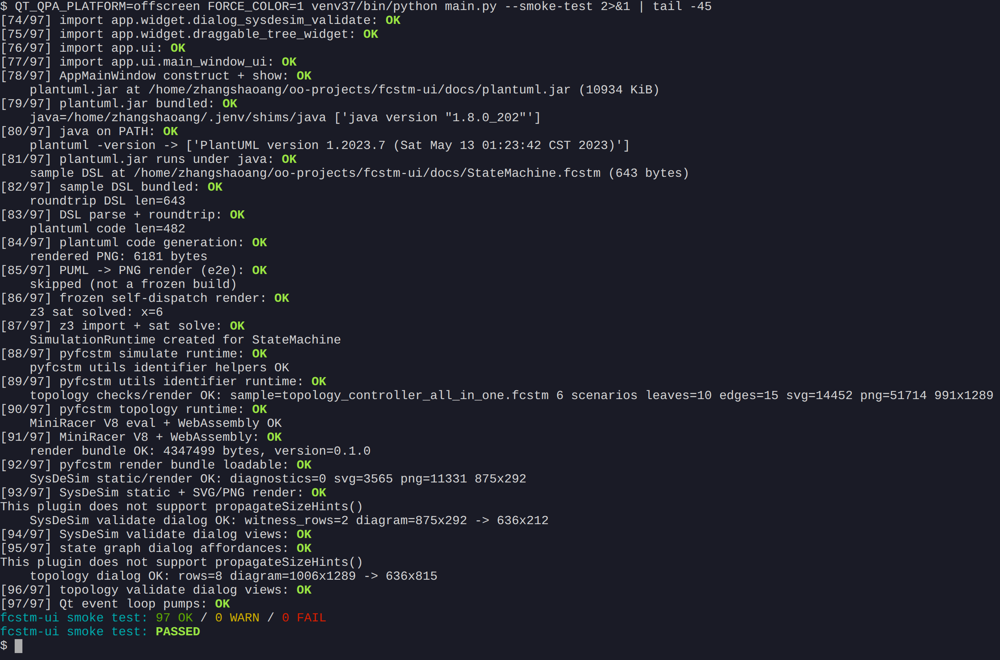

> 看到 PASSED 就万事大吉。看不到 PASSED 时，最后那段日志会指明是哪一行 case 失败（缺 Java、缺字体、缺模板包 …），按提示修一下再跑就行——demo 现场遇到的概率极低，主要是新机器第一次部署时使用。
>
> 把输出重定向到文件或者管道时（例如配合 `tee` / `tail`），会自动关掉 ANSI；如果想强制保留颜色就在前面加 `FORCE_COLOR=1`；如果要彻底去色加 `NO_COLOR=1`。

接下来全部演示在 GUI 里完成。

---

## 2. 启动 fcstm-ui 与主窗口导览

启动方式：双击 `fcstm-ui`，或在终端运行 `fcstm-ui`。第一次打开时主窗口是空白模型，本节先认识它的布局。

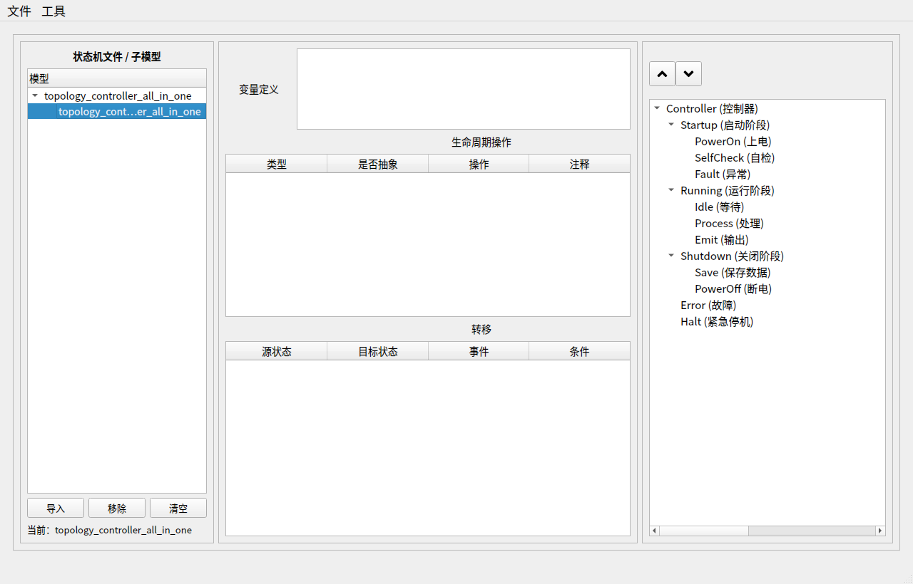

主窗口分四块：

| 位置 | 名称 | 演示要点 |
|---|---|---|
| 最上方 | **菜单栏**：`文件` / `工具` | 所有功能入口都在这两个菜单里。`文件 → 导入` 加模型；`工具` 菜单下有"拓扑验证（可达/有穷/必达）"和"SysDeSim时间线验证"两个今天要演示的对话框 |
| 左栏 | **状态机文件 / 子模型** 面板 | 列出已加载的模型；下方有 `导入` / `移除` / `清空` 三个按钮；最下方一行"当前：xxx"显示选中的模型名 |
| 中栏 | **变量定义 / 生命周期操作 / 转移** 三个表格 | 选中某个模型 + 某个状态后，会展示该状态的属性 |
| 右栏 | **状态树** | 选中的模型的层次结构。可展开折叠（顶部箭头按钮） |

整个窗口可以拖动调整大小；右下角拖动手柄放大可以让对话框看得更清楚（演示时建议拉到 1280×800 以上）。

---

## 3. 导入拓扑示例并查看状态图

### 3.1 导入 `topology_controller_all_in_one.fcstm`

操作步骤：

1. 在菜单栏点 **`文件`**，下拉出现 **`导入`**，点它。
2. 弹出系统文件选择对话框。把目录切到本指南配套的工作目录，选中 **`topology_controller_all_in_one.fcstm`**，点 **`打开`**。
3. 主窗口左栏 **状态机文件 / 子模型** 面板里出现一行新模型：**`topology_controller_all_in_one`**。点击该行，使其变蓝（选中）。
4. 右栏 **状态树** 自动展开，显示根状态 **`Controller (控制器)`**，下面有 5 个子节点：`启动阶段` / `运行阶段` / `关闭阶段` / `故障` / `紧急停机`。

> 这是一份特意造的"全功能"DSL —— 嵌套复合状态、初始/终止伪状态、循环、分叉一应俱全；§5 三个不同的拓扑校验都用它跑。

### 3.2 查看 PlantUML 状态图

操作步骤：

1. 在菜单栏点 **`工具`** → **`状态图生成`**。
2. 弹出 **状态图** 对话框：左半边是渲染参数面板，右半边是图形画布。
3. 默认会自动渲染。等几秒（PlantUML 子进程在跑 Java），画布上出现状态图：

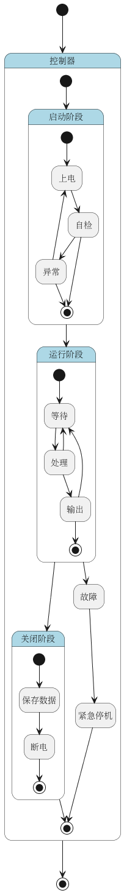

> 这一张图同时验证了：jar 文件可用、Java 在 PATH、中文渲染没乱码。
>
> 画布里：**鼠标滚轮**缩放；**按住鼠标左键拖动**平移；**右键** → 弹出菜单可以"保存当前图片为 PNG"。
>
> 演示完关闭对话框即可（点右上角 ×）。

---

## 4. 演示重头戏（一）：拓扑验证对话框

### 4.1 打开对话框，认识它

操作：菜单栏 **`工具`** → **`拓扑验证（可达/有穷/必达）`**，弹出 **拓扑验证** 对话框。

对话框分上中下三块（请对照下面任意一张截图看）：

- **顶部 验证设置 GroupBox**：
  - **状态机**（下拉框）：选择当前要验证的模型（已经默认是 `topology_controller_all_in_one`）。
  - **检查项**（下拉框）：3 选 1：`3.4 可达性` / `3.5 有穷性` / `3.6 必达性`。
  - **使用默认初态**（复选框）：勾上时，源状态自动取根的初态链；不勾时下面的 **源状态** 下拉可以手选。
  - **源状态**（下拉框）：勾了"使用默认初态"会变灰。
  - **目标状态**（下拉框）：可达性/必达性时需要；有穷性时会变灰。
- **中部 结果 GroupBox**：三个 Tab：
  - `报告`：人类可读的总览（顶部一条状态横幅 + 下方多行总结）。
  - `路径 / 节点`：把见证路径 / 反例路径 / 不可达叶子等以表格形式列出。
  - `拓扑图`：渲染出的拓扑图，**反例时拓扑图顶部会有红色横幅 + 节点会用颜色标出**。
- **底部按钮行**：**`开始验证`** / `保存 JSON` / `导出 SVG` / `导出 PNG` / `关闭`。

> 一句话语义：拓扑层只看「形状」——所有 guard / event / variable 都被忽略，每条声明的转移都当作可能发生。这意味着：
> - `Idle ↔ Process ↔ Emit` 在拓扑层就是个 trap_cycle（哪怕 `Emit → [*]` 也存在，因为可能不取它）
> - `Error → Halt → [*]` 提供了一条从根可到 `[*]` 的 alt_end 路径
>
> 所以同一份 DSL 能演示出 6 个截然不同的判定结果。

### 4.2 场景 1 ✅ —— 可达性成立

> 故事：「从开机一路到关机断电是结构上可达的吗？」

操作步骤：

1. **检查项** 选 **`3.4 可达性`**。
2. **使用默认初态** 保持勾选（默认从根的初态 `Controller.Startup.PowerOn` 出发）。
3. **目标状态** 选 **`Controller.Shutdown.PowerOff`**。
4. 点底部 **`开始验证`**。
5. 切到 **报告** Tab：顶部出现绿色横幅 **`验证结果：可达`**，下方"见证路径"一行列出 7 个节点的完整路径。

| `报告` Tab | `路径 / 节点` Tab | `拓扑图` Tab |
|---|---|---|
| 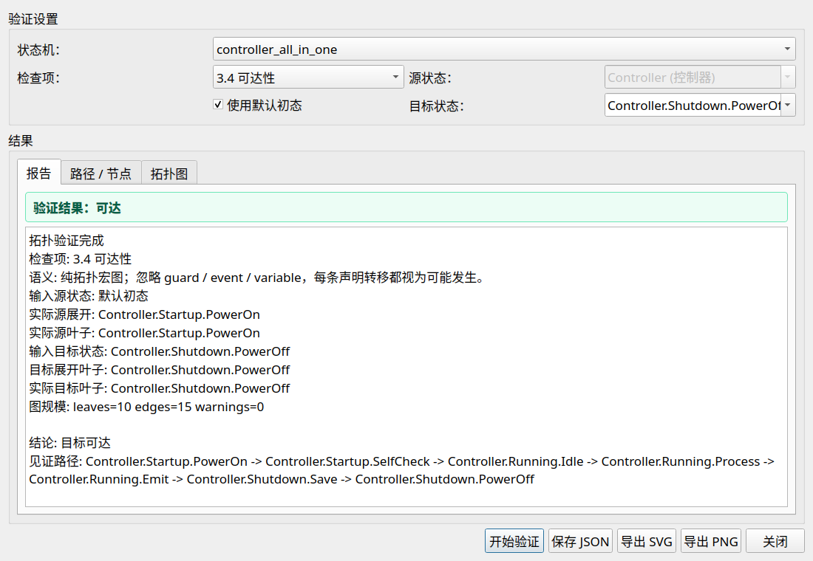 | 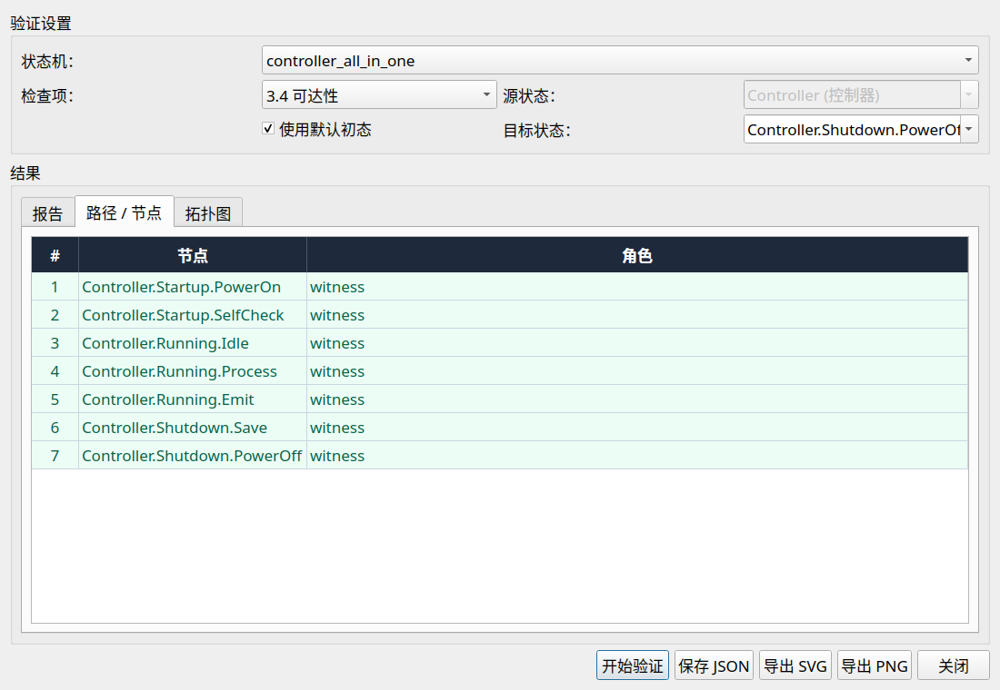 | 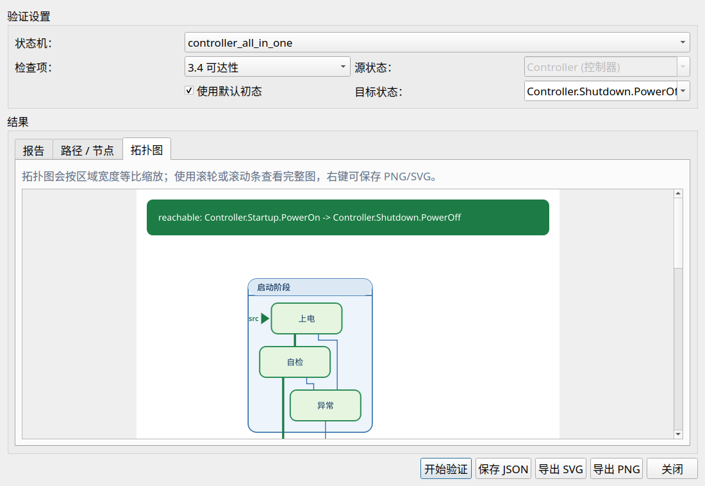 |

### 4.3 场景 2 ❌ —— 可达性不成立

> 故事：「断电之后还能回到开机吗？显然不能。」

操作步骤：

1. **检查项** 保持 **`3.4 可达性`**。
2. **取消勾选** "使用默认初态"——这一步让"源状态"下拉变可用。
3. **源状态** 选 **`Controller.Shutdown.PowerOff`**。
4. **目标状态** 改为 **`Controller.Startup.PowerOn`**。
5. 点 **`开始验证`**。
6. 切到 **报告** Tab：顶部出现红色横幅 **`验证结果：不可达`**，下方"不可达叶子数"列出 9 个回不去的状态。

| `报告` Tab | `路径 / 节点` Tab | `拓扑图` Tab |
|---|---|---|
| 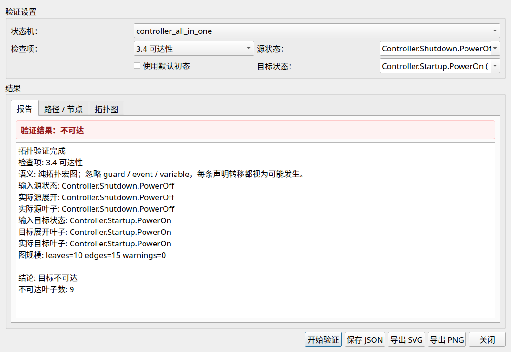 | 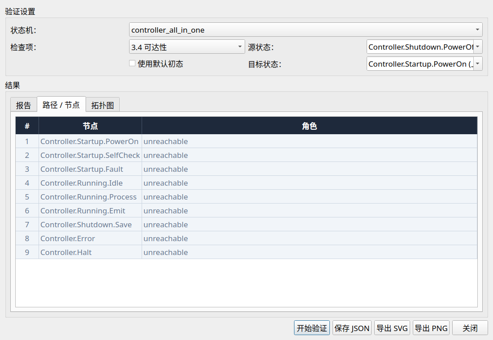 | 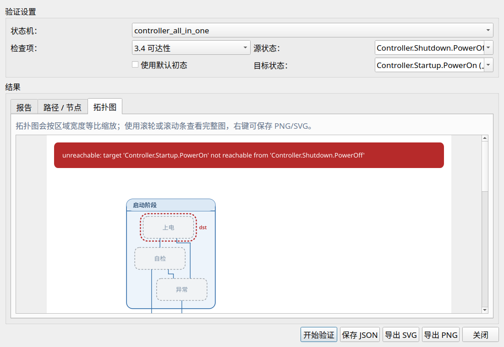 |

### 4.4 场景 3 ✅ —— 有穷性成立（关机阶段一定能走到终止）

> 故事：「从'保存数据'出发，最终一定能走完吗？」

操作步骤：

1. **检查项** 切到 **`3.5 有穷性`**——会发现"目标状态"下拉自动变灰，因为有穷性不需要目标。
2. **使用默认初态** 保持不勾。
3. **源状态** 选 **`Controller.Shutdown.Save`**。
4. 点 **`开始验证`**。
5. **报告** Tab 顶部出现绿色 **`验证结果：有穷`**。

| `报告` Tab | `路径 / 节点` Tab | `拓扑图` Tab |
|---|---|---|
| 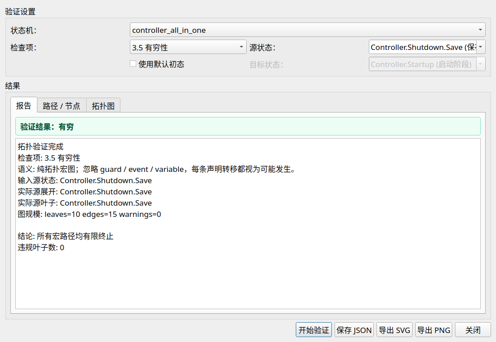 | 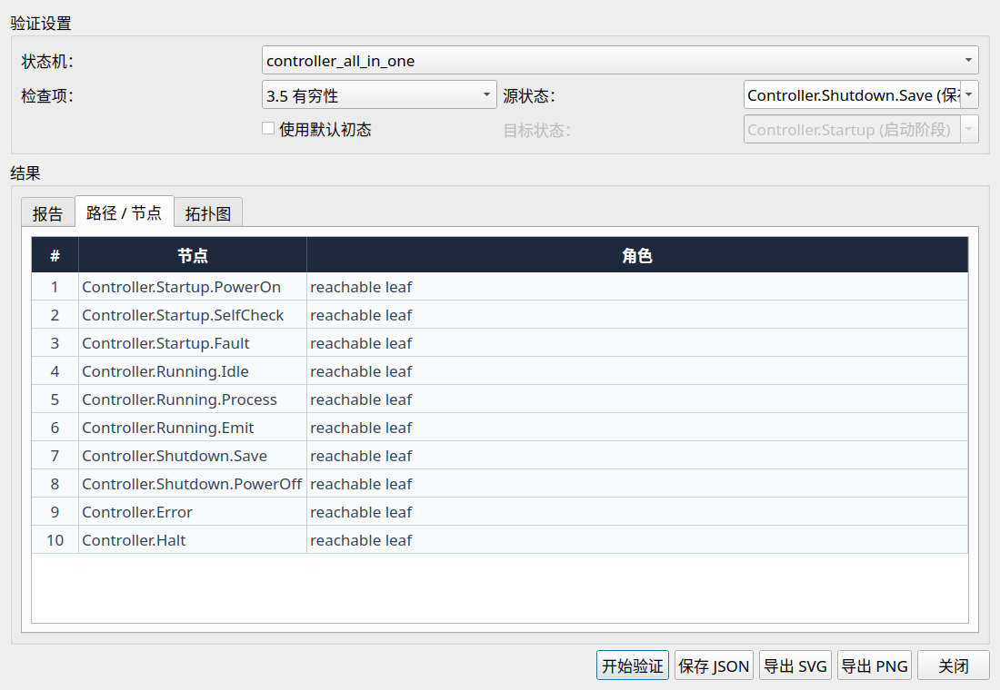 | 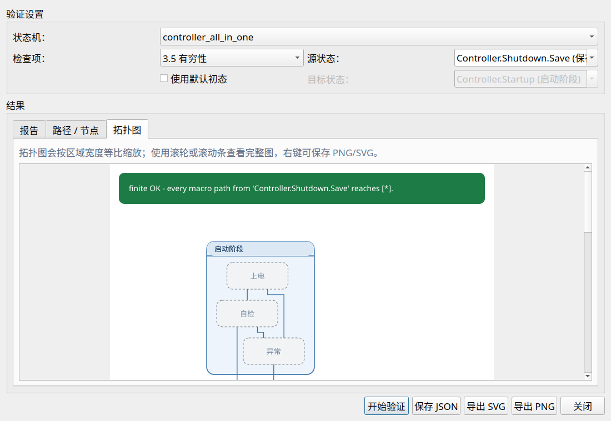 |

### 4.5 场景 4 ❌ —— 有穷性不成立（运行循环陷阱）

> **演示亮点**：这一节最直观——`拓扑图` Tab 会把陷阱环 3 个节点染红。

操作步骤：

1. **检查项** 仍是 **`3.5 有穷性`**。
2. **使用默认初态** **重新勾选**。
3. 点 **`开始验证`**。
4. **报告** Tab 顶部出现红色 **`验证结果：存在无限运行反例`**，反例路径里有一段 `[cycle: Controller.Running.Idle -> Controller.Running.Process -> Controller.Running.Emit -> Controller.Running.Idle]`。
5. **切到 `拓扑图` Tab**：图最上方是一条红色横幅 **`infinite FAIL — trap cycle [等待 -> 处理 -> 输出 -> 等待] (6 violating leaf)`**，下面渲染的拓扑图里这 3 个节点用红色边框高亮。

| `报告` Tab | `路径 / 节点` Tab | `拓扑图` Tab（**重点**） |
|---|---|---|
| 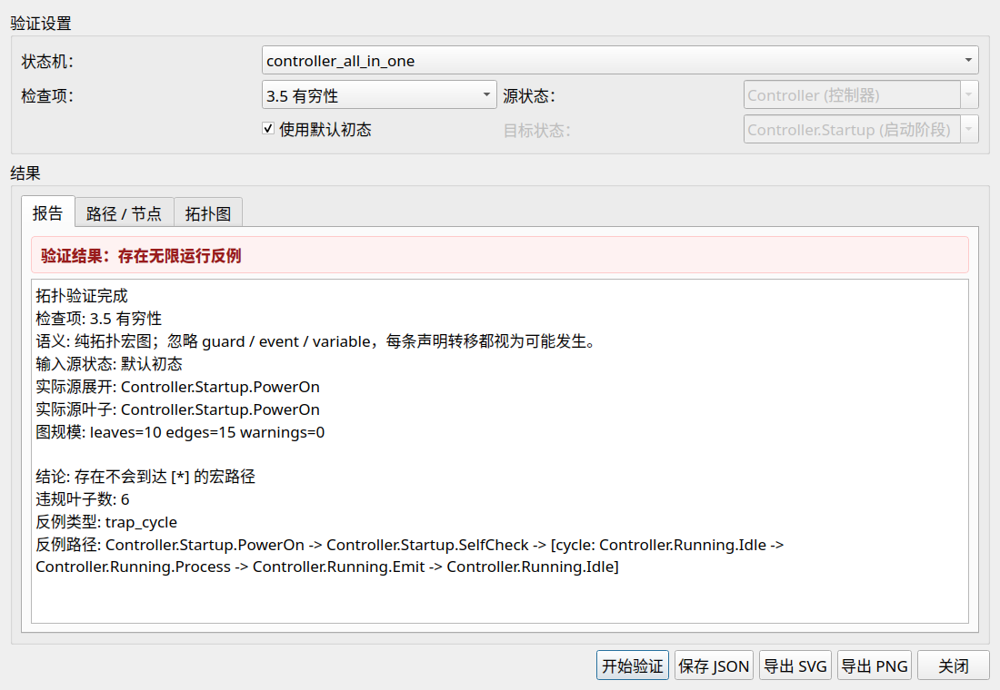 | 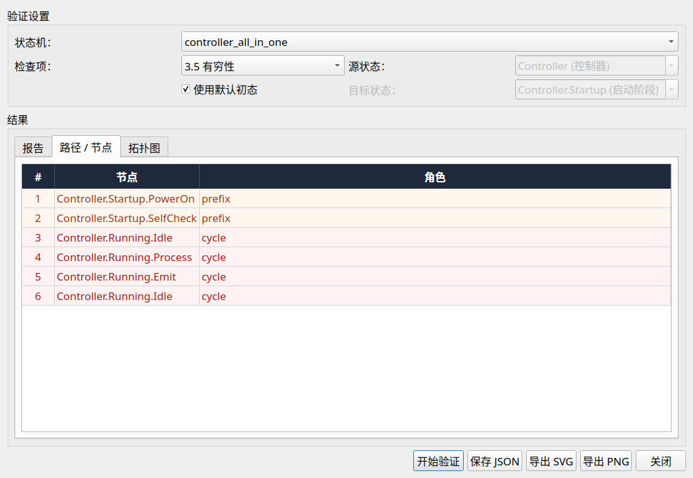 | 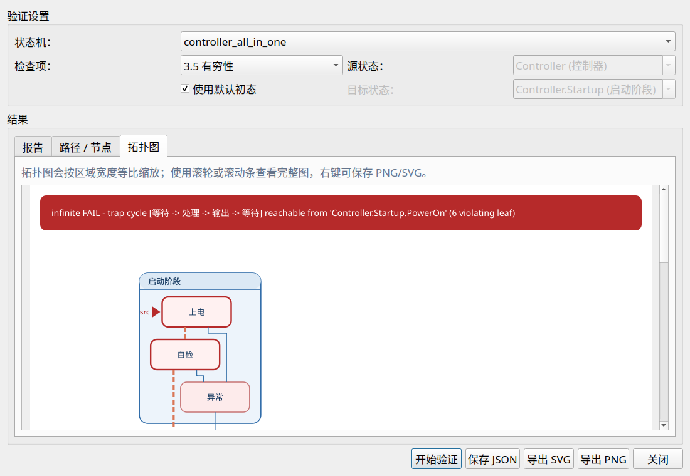 |

### 4.6 场景 5 ✅ —— 必达性成立

> 故事：「从'保存数据'出发，'断电'是不是一定会经过？」

操作步骤：

1. **检查项** 切到 **`3.6 必达性`**。
2. **使用默认初态** 取消勾选。
3. **源状态** 选 **`Controller.Shutdown.Save`**。
4. **目标状态** 选 **`Controller.Shutdown.PowerOff`**。
5. 点 **`开始验证`**。
6. **报告** Tab 顶部出现绿色 **`验证结果：必达`**。

| `报告` Tab | `路径 / 节点` Tab | `拓扑图` Tab |
|---|---|---|
| 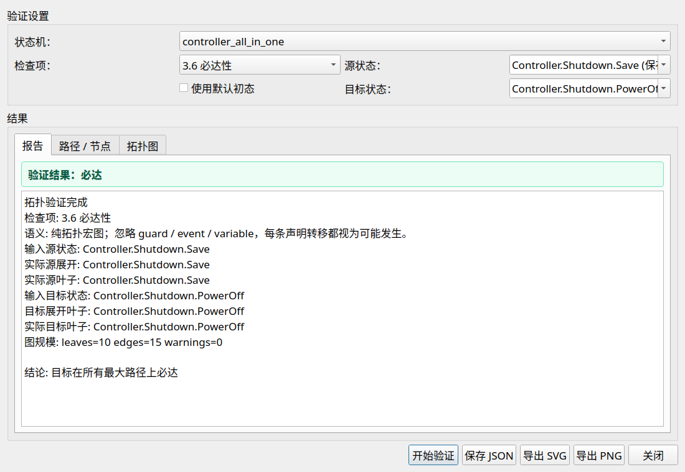 | 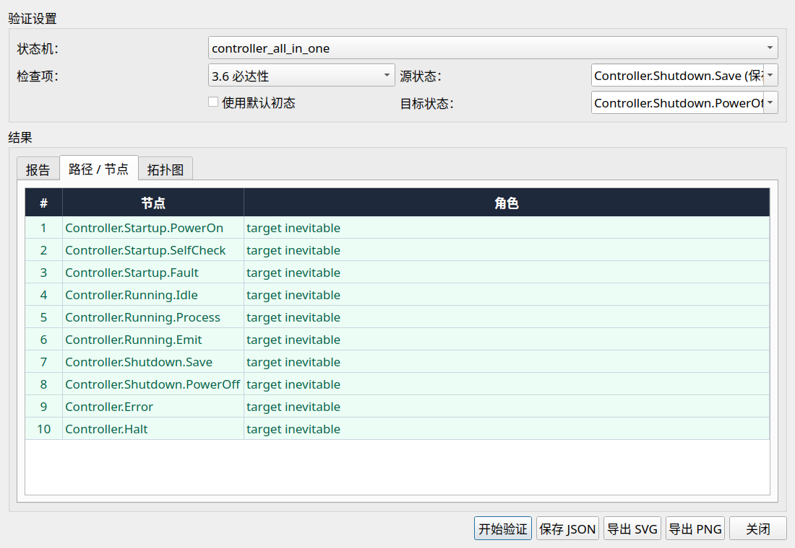 | 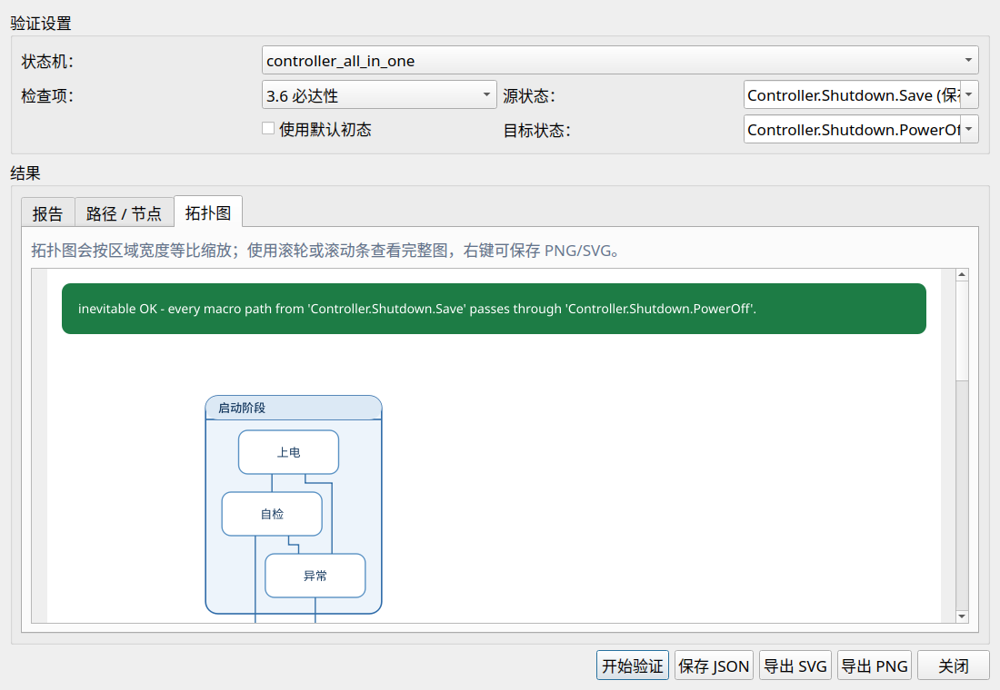 |

### 4.7 场景 6 ❌ —— 必达性不成立（紧急停机绕过保存）

> **演示亮点**：这一节给出最具语义价值的反例——「保存数据并不是结构上必经的，紧急停机这条路就能绕开它」。

操作步骤：

1. **检查项** 仍是 **`3.6 必达性`**。
2. **使用默认初态** 重新勾选。
3. **目标状态** 改为 **`Controller.Shutdown.Save`**。
4. 点 **`开始验证`**。
5. **报告** Tab 顶部出现红色 **`验证结果：可规避`**，下方反例路径是 `Controller.Startup.PowerOn → ... → Controller.Running.Emit → Controller.Error → Controller.Halt → [*]`——即"运行到一半触发故障 → 紧急停机 → 直接结束"。

| `报告` Tab | `路径 / 节点` Tab | `拓扑图` Tab |
|---|---|---|
| 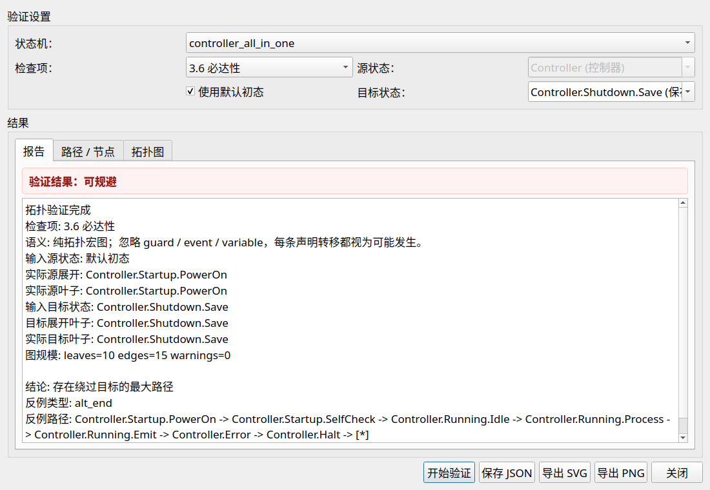 | 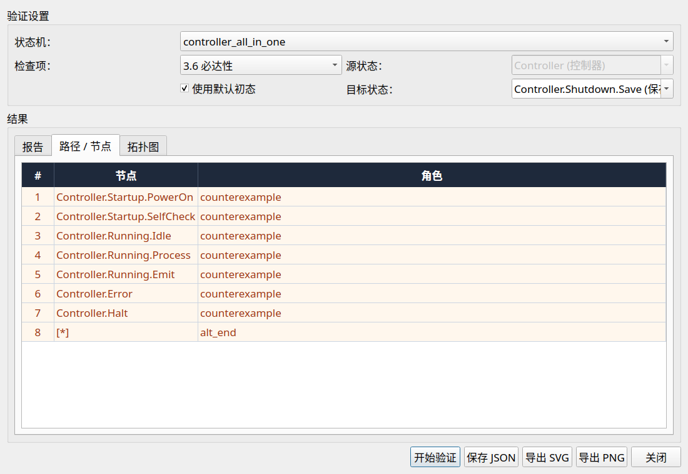 | 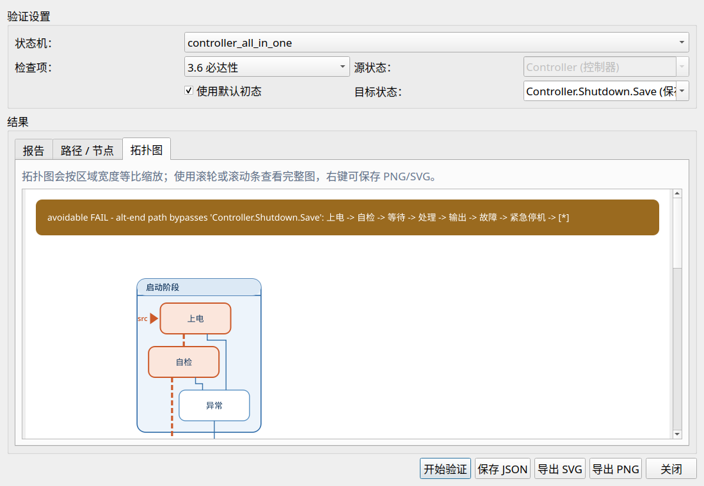 |

> 演示讲解话术：「这条反例在产品语义上是合理的——出故障了当然要紧急停机直接退出——但它正好绕开了'保存数据'，所以'数据一定能保存'这件事在结构上其实没有保证。这就是拓扑必达性这个检查的意义：它把'我以为必经'与'结构上确实必经'之间的差距挑出来。」

### 4.8 保存与导出（可选演示）

底部按钮：

- **`保存 JSON`**：把刚才那次验证的完整结果（含见证 / 反例 / 图结构）落盘为 JSON。
- **`导出 SVG`** / **`导出 PNG`**：把拓扑图导出为图像文件，方便贴到 PPT / 报告里。
- **`关闭`**：关掉对话框。

---

## 5. 演示重头戏（二）：SysDeSim 时间线验证 — H.M vs X

> 故事弧：先做"找见证"（v2 文件，**SAT**），再做"触发反例"（v2_z1200 文件，**静态预检直接拦截**）。两个一对照，工具链的价值最清楚。

### 5.1 导入 `单个用例_v2.xml`

操作步骤：

1. 菜单栏 **`文件`** → **`导入`**。
2. 文件对话框里把过滤切到"所有支持类型"，选 **`单个用例_v2.xml`**，点 **`打开`**。
3. 弹出第一个对话框：**选择 FCSTM 文件输出目录**——这里是把 XML 转换出来的 `.fcstm` 落盘的位置。随便选一个空目录就行（demo 时建议预先建一个 `demo_output/`）。
4. 弹出第二个对话框：**SysDeSim 转换选项**——所有字段保持默认（状态机名 / ID 留空、tick 选"自动"、不勾"生成 SysDeSim 转换诊断报告"），点 **`OK`**。
5. 等几秒（转换有一点点 CPU 开销）。完成后主窗口左栏 **`状态机文件 / 子模型`** 面板里会以 XML 文件名为**顶层分组节点**多出一个 **`单个用例_v2`**（已自动展开），它下面挂着 5 行子模型——同一份 XML 转出来的全部状态机都会被工具自动归到这一组里：
   - `StateMachine`（根状态机，导入完默认选中它，下方"当前："行会显示 `当前：StateMachine`）
   - `StateMachine__Control_region1`
   - `StateMachine__Control_region2`
   - `StateMachine__Control_region3`
   - `StateMachine__Control_region4`

   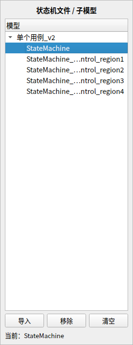

6. 注意"来源"这个概念**不是单独一列**，而是**靠分组节点本身的标签**来体现的——点开 `单个用例_v2` 这个分组就能看到属于它的全部 5 行模型；如果之后再导入第二个 XML（比如 §5.5 的 `单个用例_v2_z1200_experiment`），左栏会再多一个并列的分组节点，下面同样挂 5 行子模型，演示时一眼就能区分两批模型分别来自哪份 XML。鼠标悬停子模型行还能在 tooltip 里看到它对应的 `.fcstm` 落盘路径。

> **导出出的状态机结构**（演示讲解时可以提一句）：
> - region 1：`A → B → C → D → E`（含 `y < 2100` / `rmt < 5000` 两个数值守卫）
> - region 2：`F → W → H{ L ↔ M } / G`，外加强制转移 `!H → G : /SIG8`，guard `F → W : if [z < 1200]`
> - region 3：`J → K → S { → X, ↔ S, → O }`
> - region 4：`V`（孤岛）
>
> 本节要演示的互斥共存就发生在 region 2 的 **`H.M`** 与 region 3 的 **`X`** 之间——它们躺在两个并行 region 上，正好构成"两个并行子机能不能同时进入这俩状态"的问题。

### 5.2 打开 SysDeSim 时间线验证对话框

操作：菜单栏 **`工具`** → **`SysDeSim时间线验证`**，弹出 **SysDeSim 时间线验证** 对话框。

对话框从上到下分四块：

- **已导入 SysDeSim 模型 GroupBox**（顶部）：
  - **XML 文件**（下拉）：自动列出当前已经从 XML 导入过的来源；这里应该已经有 `单个用例_v2`。
  - **状态机名**（文本框）：留空即可（让工具自动选）。
  - **交互名**（下拉，可编辑）：每个 XML 里可能有多个顺序图；本演示用 **`测试用例1`**。
  - **tick(ms)**（数值，可设为"自动"）：保持"自动"。
- **Phase11 状态共存查询 GroupBox**（中部，这是核心）：
  - **`启用 Phase11 state query`**（复选框）：**勾选**。
  - **`静态预检 error 时跳过 SMT`**（复选框）：**勾选**（这个开关让"触发实验"那一节直接看到拦截效果）。
  - **左模型 / 左状态 / 右模型 / 右状态**：4 个下拉框，下文 5.3 配置。
  - **观测范围**：3 选 1（`both` / `post_step` / `open_interval`），保持 **`both`**。
- **结果 GroupBox**（中下，运行后展示）：四个 Tab：
  - `报告`：人类可读总览（来源 XML、交互名、tick、静态检查计数、模型导入图大小、状态共存结果）。
  - `SAT 轨迹`：SMT 找出的 witness timeline，按时刻一行一行展开，每个并行 region 一列；**最右一列 `co` 标 `start` 的那一行就是"互斥共存第一次成立"的时刻**。
  - `静态诊断`：静态预检的 error/warning 表格 + 详细说明。
  - `顺序图`：渲染的顺序图 + 顶部黄色 banner（叠加静态诊断和"first coexistence"摘要）。
- **底部按钮行**：**`开始验证`** / `保存 JSON 报告` / `导出 SVG` / `导出 PNG` / `关闭`。

> 提示：**交互名**下拉的存在感比看上去要重要。一个 SysDeSim XML 里可以挂多个顺序图（sequence diagram），切换下拉即等于切换被验证的剧本。本演示的 `单个用例_v2.xml` 只有一个 `测试用例1`，所以下拉只有一项；但如果换成像 `三个用例.xml` 这种含 3 个剧本的文件，同一份 XML 一次性导入后，**交互名**下拉会直接出现 `测试用例1` / `测试用例2` / `测试用例3` 三个可选项——展示时直接点开下拉切换即可，对同一组模型反复验证不同的剧本，不必重新导入。
>
> 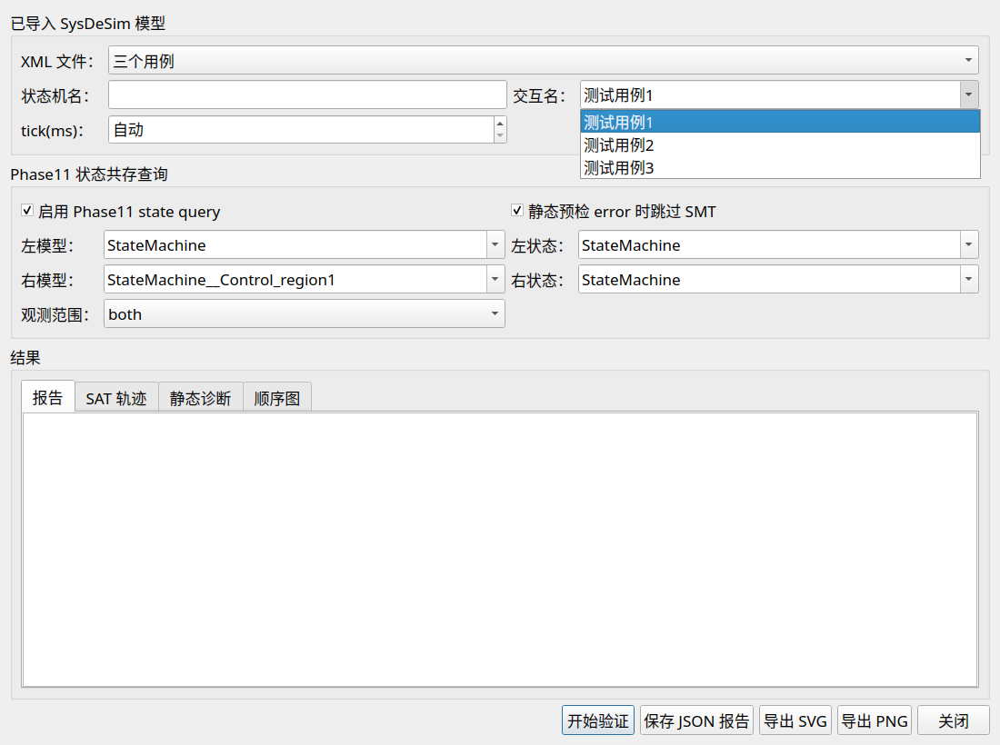

### 5.3 配置 H.M ↔ X 共存查询

按下面的表挨个点：

| 字段 | 操作 |
|---|---|
| **XML 文件**（顶部下拉） | 选 **`单个用例_v2`** |
| **交互名**（顶部下拉） | 选 **`测试用例1`** |
| **tick(ms)** | 保持"自动" |
| **`启用 Phase11 state query`** | ✓ 勾选 |
| **`静态预检 error 时跳过 SMT`** | ✓ 勾选 |
| **左模型**（中部第一行下拉） | 选 **`StateMachine__Control_region2`** |
| **左状态**（中部第一行下拉） | 输入或选 **`StateMachine.Control.H.M`** |
| **右模型**（中部第二行下拉） | 选 **`StateMachine__Control_region3`** |
| **右状态**（中部第二行下拉） | 输入或选 **`StateMachine.Control.X`** |
| **观测范围** | 保持 **`both`** |

确认所有字段都对上以后，点底部的 **`开始验证`**。等 1–2 秒，看到对话框中部 `结果` 区刷新即可。

### 5.4 ✅ 看 SAT 见证（主线场景）

这是本节最关键的一帧。点 **`SAT 轨迹`** Tab：

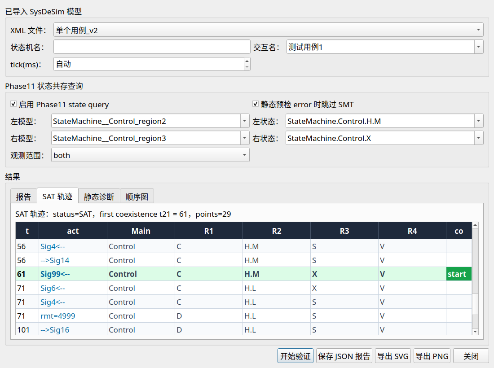

要看的内容：

- 表格上方的摘要行：**`SAT 轨迹：status=SAT，first coexistence t21 = 61，points=29`**——意思是 SMT 在 29 个时间点上找出了一条共存见证，第一次共存发生在 t=61。
- 表头：`t | act | Main | R1 | R2 | R3 | R4 | co`——`Main` 是根状态机，`R1`–`R4` 是 4 个并行 region。
- **绿色高亮那一行**：`t=61 | Sig99<-- | Main=Control | R1=C | R2=H.M | R3=X | R4=V | co=start`——这就是"H.M 和 X 第一次同时成立"的瞬间，最后一列写着 **`start`**。
- 之前的几行：可以看到 R2 一直停在 `H.M`，R3 直到 t=61 才从 `S` 跳到 `X`；之后两个 region 又会各自演化，`co=yes`/空交替出现。

其他 Tab 的内容（可选浏览）：

| `报告` Tab | `SAT 轨迹` 默认顶端 | `静态诊断` Tab | `顺序图` Tab（带 overlay） |
|---|---|---|---|
| 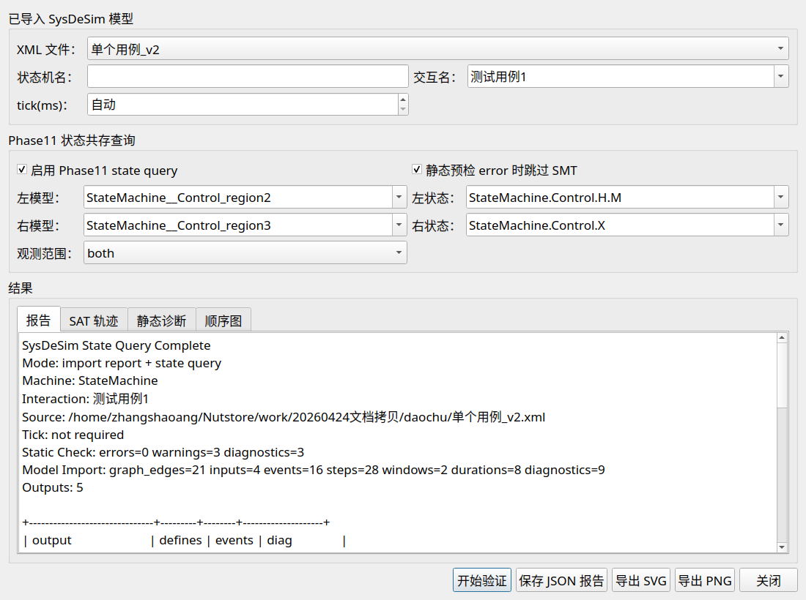 | 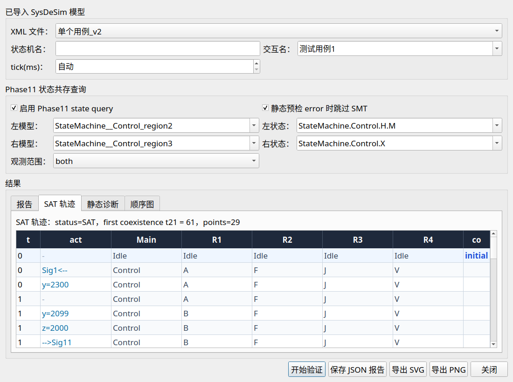 | 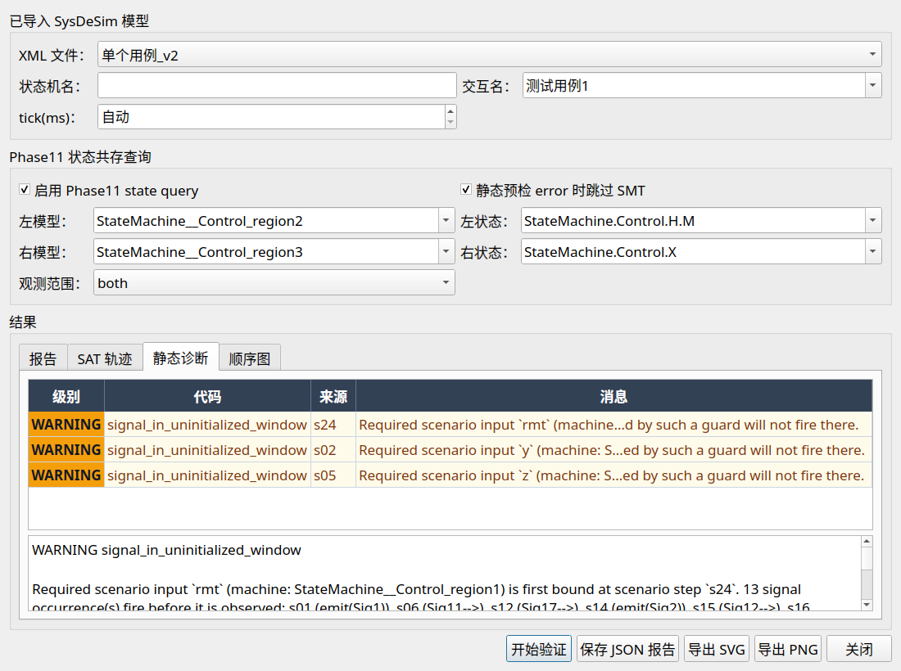 | 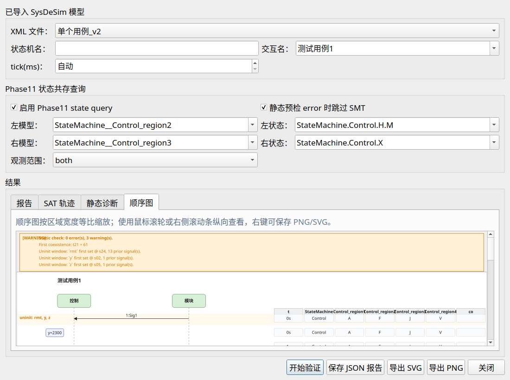 |

- `报告` Tab：开头几行 `Mode / Machine / Interaction / Tick / Static Check / Model Import / Outputs`，再往下能看到 `State Query: ... <-> ... status: SAT` 一行。
- `静态诊断` Tab：3 行黄底 WARN，都是 `signal_in_uninitialized_window`——意思是"`rmt / y / z` 这些变量在被引用之前还没绑定值（NaN），可能造成 guard 静默判 false"，是给设计者的提示，不是错误。
- `顺序图` Tab：顶部黄色 banner 把这 3 个 warning + first coexistence 都打到顺序图正上方；左边渲染的是 `控制` 和 `模块` 两条生命线；右边并排画一条 R1–R4 的状态格时间轴。

> 演示讲解话术：「同一份顺序图 + 同一对要查询的状态，工具一次性回答了三个问题：① 静态预检告诉我哪些变量初始化时机有问题（3 个 warning）；② SMT 告诉我 H.M 和 X 是不是真能共存（SAT）；③ 如果能共存，第一次发生在哪个时刻、当时 4 个并行 region 各自的状态。这三个答案同时出现在一张图上。」

### 5.5 ❌ 触发实验：把 z 改成 1200，静态预检直接拦截

> **不要关对话框**，直接复用刚才的查询配置——只把 XML 文件换掉。

如果之前没有导入 `单个用例_v2_z1200_experiment.xml`，先做一次导入：

1. **关闭** SysDeSim 时间线验证对话框（点底部 **`关闭`** 或右上角 ×）。
2. 菜单栏 **`文件`** → **`导入`**，选 **`单个用例_v2_z1200_experiment.xml`**，按 5.1 的流程再走一遍（选输出目录、转换选项保持默认）。完成后左栏会再多出 5 行模型，区分在文件名后缀，例如 `StateMachine__Control_region2_2`。
3. 重新打开 **`工具`** → **`SysDeSim时间线验证`**。

然后配置查询（**关键变更只有一个**：左/右模型要选这一次导入的版本）：

| 字段 | 操作 |
|---|---|
| **XML 文件** | 选 **`单个用例_v2_z1200_experiment`** |
| **交互名** | 选 **`测试用例1`** |
| **`启用 Phase11 state query`** | ✓ 勾选 |
| **`静态预检 error 时跳过 SMT`** | ✓ 勾选 |
| **左模型 / 左状态** | 选这一份 XML 对应的 `StateMachine__Control_region2` + `StateMachine.Control.H.M` |
| **右模型 / 右状态** | 选 `StateMachine__Control_region3` + `StateMachine.Control.X` |
| **观测范围** | `both` |

点 **`开始验证`**。这一次会发生什么：

- **`报告`** Tab 的第一段：`Mode: static pre-check only`、`Static Check: errors=1 warnings=7 ... (SMT skipped)`，最后一行 `SMT validation was skipped because static pre-check reported blocking errors.`
- **`SAT 轨迹`** Tab：空表，因为 SMT 没跑。
- **`静态诊断`** Tab（**重点**）：
  - 第一行：**红底 ERROR**，代码 `target_state_never_entered`，消息 *"Left target state 'StateMachine.Control.H.M' is never entered in the imported scenario."*
  - 后面 7 行黄底 WARNING：4 个 `signal_dropped_in_state`（Sig2/Sig9/Sig6/Sig8 在 region 2 的 `F` 状态被静默丢弃）+ 3 个 `signal_in_uninitialized_window`（与 v2 同款）。
- **`顺序图`** Tab：顶部黄色 banner 上把 ERROR + 7 个 WARN 都打出来，顺序图上方还会有"在状态 F 时丢弃 Sig9 / Sig2 / Sig6 / Sig8"的标记。

| `报告` Tab（SMT skipped） | `SAT 轨迹` Tab（空） | `静态诊断` Tab（**重点**） | `顺序图` Tab |
|---|---|---|---|
| 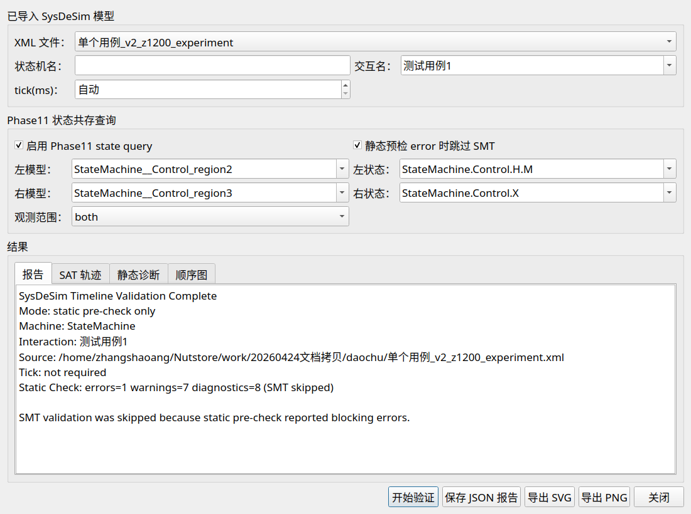 | 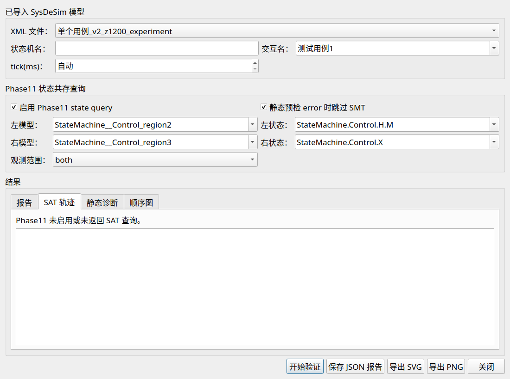 | 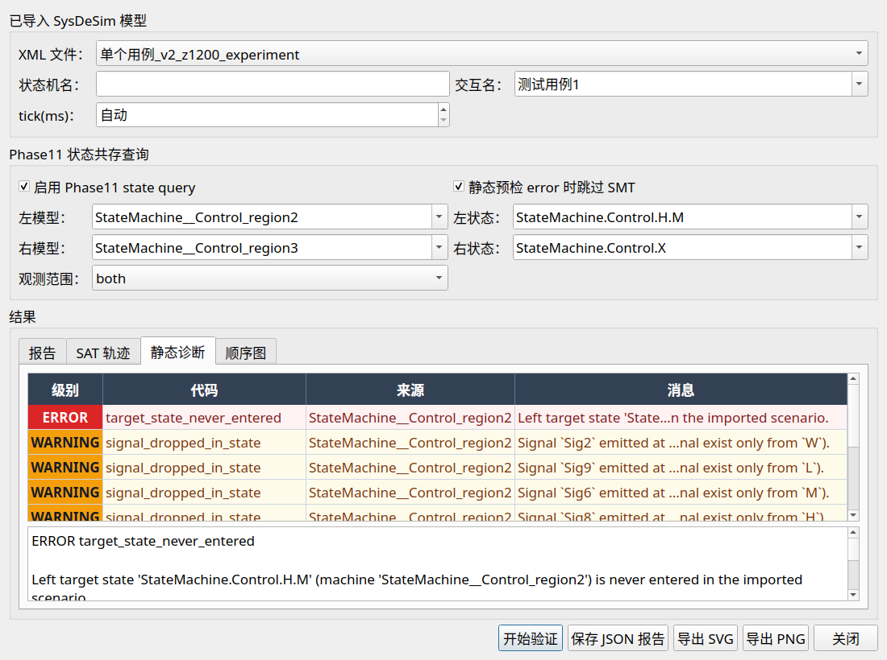 | 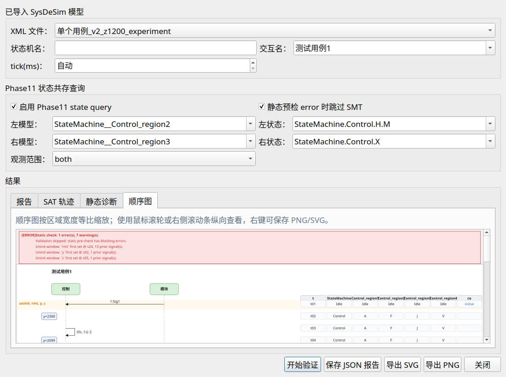 |

> 演示讲解话术：「同一份 scenario，只把 region 2 的初值 `z` 从 1100 改到 1200，原本能通过的 guard `F → W : if [z < 1200]` 瞬间变 false，于是 `F → W → H` 这条链断掉，**H.M 就永远进不去了**。这种问题不靠静态预检的话，得让 SMT 跑完才会以 UNSAT 的形式返回——既慢又不知道具体坏在哪。这里静态预检在 SMT 之前就给出了精确诊断：1 个 ERROR 把症状定位到 'H.M 永远不会被进入'，紧跟着 4 个 WARNING 把直接病因——'Sig9 在 F 状态被丢弃'——也列出来了。"

### 5.6 保存与导出（可选演示）

底部按钮：

- **`保存 JSON 报告`**：把完整验证报告（静态诊断 + 模型导入 + SAT 轨迹 + 顺序图元数据）落盘成 JSON。
- **`导出 SVG`** / **`导出 PNG`**：把顺序图（含 overlay）导出成图像。
- **`关闭`**：关掉对话框。

---

## 6. 推荐演示节奏（30 分钟）

| 时长 | 段落 | 重点说什么 |
|---|---|---|
| 2 min | §1 自检 | 终端跑一次显示 PASSED，证明装机健康；非技术听众跳过 |
| 3 min | §2 + §3 主窗口与状态图 | 三栏布局；导入 fcstm 文件；状态图渲染中文不乱码 |
| 10 min | §4 拓扑验证（6 个场景） | 重点讲 §4.5（trap_cycle）和 §4.7（alt_end）两个反例；其余 4 个走得快一点 |
| 2 min | §5.1 + §5.2 SysDeSim 导入 + 对话框结构 | 强调"一份 XML 转出 5 份并行模型" |
| 10 min | §5.4 H.M vs X 主线 | 在 SAT 轨迹页停留时间最长，把 t=61 那行讲清楚；顺便点开顺序图页展示 banner |
| 3 min | §5.5 z=1200 触发实验 | 故事弧反转：静态预检直接拦截，定位时间从分钟级压到秒级 |

---

## 附录 A：`topology_controller_all_in_one.fcstm` 全文

复制以下内容保存为 `topology_controller_all_in_one.fcstm`，即可作为 §4 全部 6 个拓扑场景的输入：

```fcstm
state Controller named "控制器" {
    state Startup named "启动阶段" {
        state PowerOn named "上电";
        state SelfCheck named "自检";
        state Fault named "异常";
        [*] -> PowerOn;
        PowerOn -> SelfCheck;
        SelfCheck -> [*];
        SelfCheck -> Fault;
        Fault -> PowerOn;
        Fault -> [*];
    }
    state Running named "运行阶段" {
        state Idle named "等待";
        state Process named "处理";
        state Emit named "输出";
        [*] -> Idle;
        Idle -> Process;
        Process -> Emit;
        Process -> Idle;
        Emit -> Idle;
        Emit -> [*];
    }
    state Shutdown named "关闭阶段" {
        state Save named "保存数据";
        state PowerOff named "断电";
        [*] -> Save;
        Save -> PowerOff;
        PowerOff -> [*];
    }
    state Error named "故障";
    state Halt named "紧急停机";
    [*] -> Startup;
    Startup -> Running;
    Running -> Shutdown;
    Running -> Error;
    Error -> Halt;
    Halt -> [*];
    Shutdown -> [*];
}
```

这份 DSL 同时具备拓扑校验需要的全部结构特征：

- 嵌套复合状态（`Startup` / `Running` / `Shutdown` 各自含子状态及内部 `[*]`）
- 明显的可达性反例：从 `PowerOff` 反向回 `PowerOn` 不可达
- 明显的有穷性反例：`Idle ↔ Process / Emit` 在拓扑层就是个 trap_cycle
- 明显的必达性反例：`Error → Halt → [*]` 这条 alt_end 路径可以绕过 `Shutdown.Save`
- 至少一条让所有 3 类校验都判 OK 的子图：从 `Save` 出发到 `PowerOff` 是有穷 + 必达 + 可达

---

## 附录 B：命令行参考（脚本化复现 / CI 使用）

> **本附录只用于"在没有桌面环境的机器上重现 §4 / §5 同等结果"**——例如 CI 或者远程服务器上的回归验证。GUI 演示流程不需要任何 CLI 操作。

### B.1 拓扑校验（对应 §4）

退出码合同：`0` = 性质成立；`1` = 反例；其他 = 用法/解析错误。

#### 可达 ✅
```bash
pyfcstm topology reach \
    -i topology_controller_all_in_one.fcstm \
    -t Controller.Shutdown.PowerOff
```
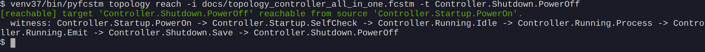

#### 可达 ❌
```bash
pyfcstm topology reach \
    -i topology_controller_all_in_one.fcstm \
    -t Controller.Startup.PowerOn \
    -s Controller.Shutdown.PowerOff
```
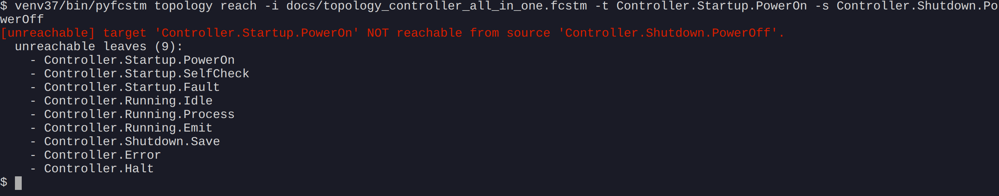

#### 有穷 ✅
```bash
pyfcstm topology finite \
    -i topology_controller_all_in_one.fcstm \
    -s Controller.Shutdown.Save
```
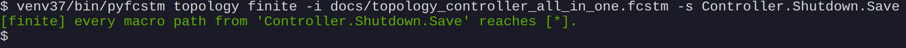

#### 有穷 ❌
```bash
pyfcstm topology finite \
    -i topology_controller_all_in_one.fcstm
```
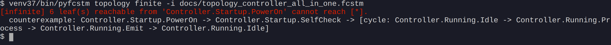

#### 必达 ✅
```bash
pyfcstm topology inevitable \
    -i topology_controller_all_in_one.fcstm \
    -t Controller.Shutdown.PowerOff \
    -s Controller.Shutdown.Save
```
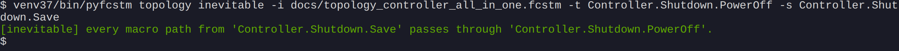

#### 必达 ❌
```bash
pyfcstm topology inevitable \
    -i topology_controller_all_in_one.fcstm \
    -t Controller.Shutdown.Save
```
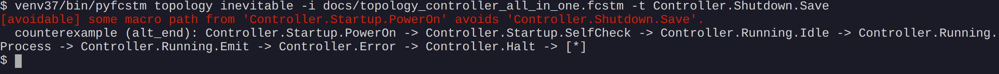

### B.2 SysDeSim（对应 §5）

#### 列交互（顺序图）
```bash
pyfcstm sysdesim list-interactions -i 单个用例_v2.xml
```
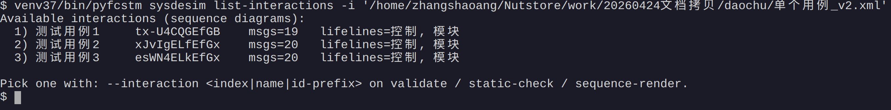

#### 静态预检
```bash
pyfcstm sysdesim static-check -i 单个用例_v2.xml --interaction 1
```
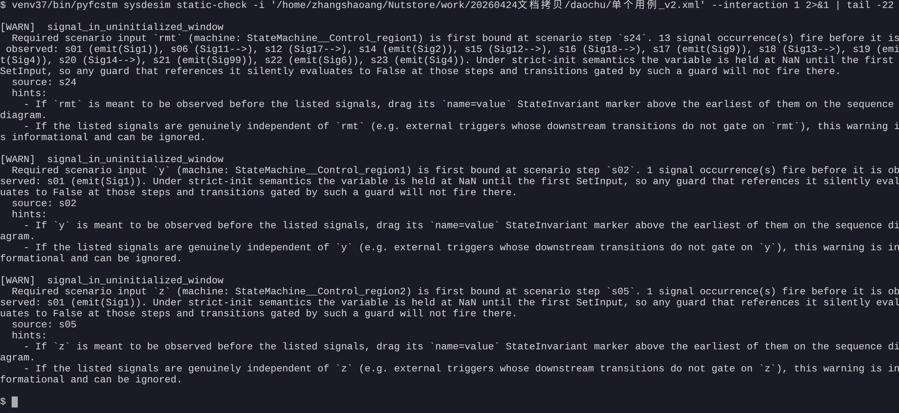

#### 时间线验证 ✅（H.M vs X，SAT）
```bash
pyfcstm sysdesim validate \
    -i 单个用例_v2.xml \
    --interaction 1 \
    --left-machine-alias  StateMachine__Control_region2 \
    --left-state          StateMachine.Control.H.M \
    --right-machine-alias StateMachine__Control_region3 \
    --right-state         StateMachine.Control.X
```
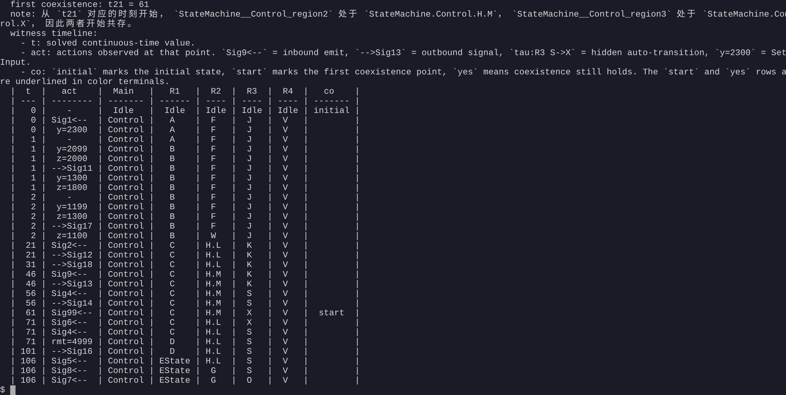

#### 时间线验证 ❌（z=1200，静态预检拦截）
```bash
pyfcstm sysdesim validate \
    -i 单个用例_v2_z1200_experiment.xml \
    --interaction 1 \
    --left-machine-alias  StateMachine__Control_region2 \
    --left-state          StateMachine.Control.H.M \
    --right-machine-alias StateMachine__Control_region3 \
    --right-state         StateMachine.Control.X
```
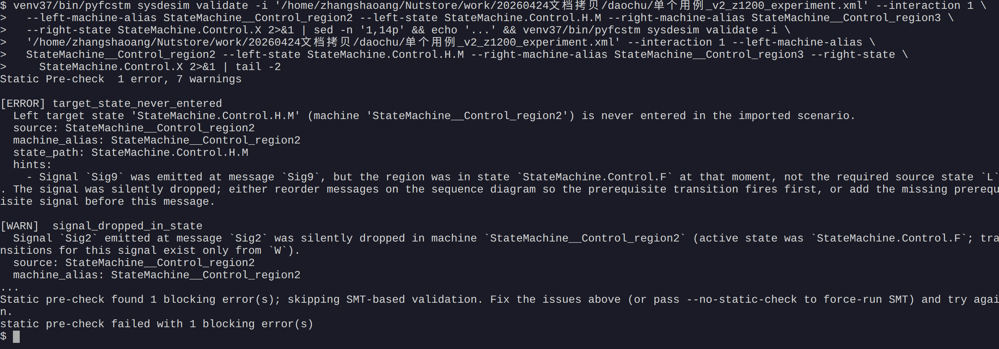

### B.3 顶层自检
```bash
fcstm-ui --smoke-test
pyfcstm  --smoke-test
```
分别期望 `97 OK / 0 WARN / 0 FAIL` 和 `46 PASS (out of 46)`。详细截图见 §1。

祝展示顺利。
